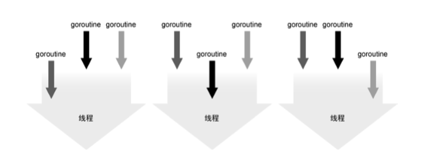
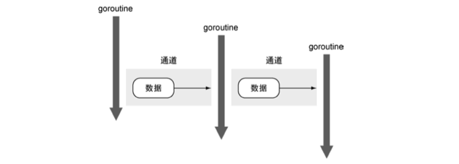
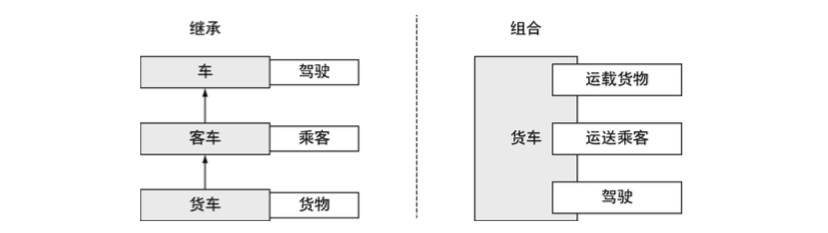

# 关于 Go 语言的介绍

计算机一起在演化，但是编程语言并没有以同样的速度演化。手机内置的 CPU 核数可能都多于自己使用的第一台电脑，高性能服务器更是
拥有更多的核数，但是我们依旧在使用为单核设计的技术在编程。

Go 语言让代码分享更容易，并且自带一些工具，令使用别人写的包更容易。

## 用 Go 解决现代编程难题

C 和 C++ 这类语言提供了很快的执行速度，而 Ruby 和 Python 这类语言则擅长快速开发。Go 在这两者之间架起了桥梁，不仅提供了高性
能，也让开发更快速。

Go 语言的语法简洁便于记忆。Go 语言的编译器速度非常快，能显著减少项目构建时间。因为 Go 语言内置并发机制，所以不用被迫使用特
定的线程库，就能让软件扩展，使用更多的资源。Go 语言的类型系统简单且高效，不需要为面向对象开发付出额外的心智，让开发者专注于
代码复用。Go 语言还自带垃圾回收器，不需要用户自己管理内存。

### 开发速度

Go 语言使用了更智能的编译器，简化了解决依赖的算法，最终提供了更快的编译速度。编译 Go 程序时，编译器只会关注那些直接被引用的
库，而不是像 Java、C 和 C++ 那样，要遍历依赖链中所有依赖的库。

因为没有从编译代码到执行代码的中间过程，用动态语言编写应用程序可以快速看到输出。代价是，动态语言不提供静态语言提供的类型安
全特性，不是不经常用大量的测试套件来避免在运行的时候出现类型错误这类 bug。

### 并发

作为程序员，要开发出能充分利用硬件资源的应用程序是一件很难的事情。现代计算机都拥有多个核，但是大部分编程语言都没有有效的工
具让程序可以轻易利用这些资源。这些语言需要写大量的线程同步代码来利用多个核，很容易导致错误。

Go 语言对并发的支持是这门语言最重要的特性之一。goroutine 很像线程，但是它占用的内存远少于线程，使用它需要的代码更少。通道
(channel)是一种内置的数据结构，可以让用户在不同的 goroutine 之间同步发送具有类型的消息。这让编程模型更倾向于在 goroutine 
之间发送消息，而不是让多个 goroutine 争夺同一个数据的使用权。

1.	**goroutine**: goroutine 是可以与其他 goroutine 并行执行的函数，同时也会与主程序（程序的入口）并行执行。在其他语言中，需要用线程来完成
	同样的事情，而在 Go 语言中会使用同一个线程来执行多个 goroutine。goroutine 使用的内存比线程更少，Go 语言运行时会自动在配
	置的一组逻辑处理器上调度执行 goroutine。每个逻辑处理器绑定到一个操作线程上，如下图。

	如果想在执行一段代码的同时，并行去做另外一些事情，goroutine 是很好的选择。以下是一个简单的例子：

	```
	func log(msg string) {
		...这里是一些记录日志的代码
	}

	// 代码里有些地方检测到了错误
	go log("发生了可怕的事情")
	```

	关键字 go 是唯一需要去编写的代码，调度 log 函数作为独立的 goroutine 去运行，以便与其他 goroutine 并行执行。这意味着应用
	程序的其余部分会与记录日志并行执行，通常这种并行能让用户觉得性能更好。就像之前说的，goroutine 占用的资源更少，所以常常
	能启动成千上万个 goroutine。

2.	**通道**: 通道是一种数据结构，可以让 goroutine 之间进行安全的数据通信。通道可以帮用户避免其他语言里常见的共享内存访问的问题。
	
	并发的最难部分就是要确保其他并发运行的进程、线程或 goroutine 不会意外修改用户的数据。当不同的线程在没有同步保护的情况下
	修改同一个数据时，总会发生灾难。在其他语言中，如果使用全局变量或共享内存，必须使用复杂的锁规则来防止对同一个变量的不同
	步修改。

	为了解决这个问题，通道提供了一种新模式，从而保证并发修改时的数据安全。通道这一模式保证同一时刻只会有一个 goroutine 修改
	数据。通道用于在几个运行的 goroutine 之间发送数据。下图可以看到数据是如何流动的。
	想象一个应用程序，有多个进程需要顺序读取或者修改某个数据，使用 goroutine 和通道，可以为这个过程建立安全的模型。上图有 
	3 个 goroutine，还有 2 个不带缓存的通道。第一个 goroutine 通过通道把数据传给已经在等待的第二个 goroutine。在两个 goroutine 
	之间传输数据是同步的，一旦传输完成，两个 goroutine 都会知道数据已经完成传输。当第二个 goroutine 利用这个数据完成其任务后，
	将这个数据传给第三个正在等待的 goroutine。这次传输依旧是同步的，两个 goroutine 都会确认数据传输完成。这种在 goroutine 之
	间安全传输数据的方法不需要任何锁或者同步机制。

	需要强调的是，通道并不提供跨 goroutine 的数据访问保护机制。如果通过通道传输数据的一份副本，那么每个 goroutine 都持有一
	份副本，各自对自己的副本做修改是安全的。当传输是指向数据的指针时，如果读和写是由不同的 goroutine 完成的，每个 goroutine 
	依旧需要额外的同步动作。

### Go 语言的类型系统


Go 语言提供了灵活的、无继承的类型系统，无需降低运行性能就能最大程度上利用代码。这个类型系统依然支持面向对象开发，但避免了
传统面向对象的问题。Go 开发者使用**组合(composition)**设计模式，只需简单地将一个类型嵌入到另一个类型，就能利用所有的功能。
其他语言也能使用组合，但是不得不和继承绑在一起使用，结果使整个用法非常复杂，很难使用。在 Go 语言中，一个类型由其他更微小
的类型**组合**而成，避免了传统的基于继承的模型。

另外，Go 语言还具有独特的接口实现机制，允许用户对行为进行建模，而不是对类型进行建模。在 Go 语言中，不需要声明某个类型实现
了某个接口，编译器会判断一个类型的实例是否符合正在使用的接口。

1.	**类型简单**: Go 语言不仅有类似 int 和 strint 这样的内置类型，还支持用户定义的类型。在 Go 语言中，用户定义的类型通常包含一
	组带类型的字段，用于存储数据。Go 语言的类型可以声明操作该类型数据的方法。传统语言使用继承来扩展结构——Client 继承自 User，
	User 继承自 Entity，Go 语言与此不同，Go 开发者构建更小的类型——Customer 和 Admin，然后把这些小类型组合成更大的类型。下图
	展示了继承和组合之间的不同。

2.	**Go 接口对一组行为建模**: 接口用于描述类型的行为。如果一个类型的实例实现了一个接口，意味着这个实例可以执行一组特定的行
	为。甚至不需要去声明这个实例实现某个接口，只需要实现这组行为就好。其他的语言把这个特性叫做**鸭子类型**——如果它叫起来像
	鸭子，那它就可能是只鸭子。Go 语言的接口也是这么做的。在 Go 语言中，如果一个类型实现了一个接口的所有方法，那么这个类型
	的实例就可以存储在这个接口类型的实例中，不需要额外声明。

### 内存管理

不当的内存管理会导致程序崩溃或者内存泄漏，甚至让整个操作系统崩溃。Go 语言拥有现代化的垃圾回收机制，能解决这个难题。在其他
语言（如 C 或者 C++）中，使用内存前要先分配这段内存，而且使用完毕后要将其释放掉。哪怕只做错了一件事，都可能导致程序崩溃或
者内存泄漏。可惜，追踪内存是否还被使用本身就是十分艰难的事情，而想支持多线程和高并发，更是让这件事难上加难。虽然 Go 语言
的垃圾回收会有一些额外的开销，但是编程时，能显著降低开发难度。Go 语言把无趣的内存管理交给专业的编译器去做，而让程序员专注
于更有趣的事情。
