# 数组、切片和映射

Go 语言有 3 种数据结构可以让用户管理集合数据：数组、切片和映射。这 3 种数据结构是语言核心的一部分，在标准库里被广泛使用。

## 数组的内部实现和基础功能

了解这些数据结构，一般会从数组开始，因为数组是切片和映射的基础数据结构。理解了数组的工作原理，有助于理解切片和映射提供的优雅和强大的功能。

### 内部实现

在 Go 语言里，数组是一个长度固定的数据类型，用于存储一段具有相同的类型的元素的连续块。数组存储的类型可以是内置类型，如整型或者字符串，也
可以是某种结构类型。

下图中可以看到数组的表示。灰色格子代表数组里的元素，每个元素都紧邻另一个元素。每个元素包含相同的类型，这个例子里是整数，并且每个元素都可
以用一个唯一的索引（也称下标或标号）来访问。

数组是一种非常有用的数据结构，因为其占用的内存是连续分配的。由于内存连续，CPU 能把正在使用的数据缓存更久的时间。而且内存连续很容易计算索
引，可以快速迭代数组里的所有元素。数组的类型信息可以提供每次访问一个元素时需要在内存中移动的距离。既然数组的每个元素类型相同，又是连续分
配，就可以以固定速度索引数组中的任意数据，速度非常快。

### 声明和初始化

声明数组时需要指定内部存储的数据的类型，以及需要存储的元素的数量，这个数量也称为数组的长度。

> 声明一个数组，并设置为零值

```
// 声明一个包含 5 个元素的整型数组
var array [5]int
```

一旦声明，数组里存储的数据类型和数组长度就都不能改变了。

在 Go 语言中声明变量时，总会使用对应类型的零值来对变量进行初始化。数组也不例外。当数组初始化时，数组内每个元素都初始化为对应类型的零值。

一种快速创建数组并初始化的方式是使用数组字面量。数组字面量允许声明数组里元素的数量同时指定每个元素的值。

> 使用数组字面量声明数组

```
// 声明一个包含 5 个元素的整型数组
// 用具体值初始化每个元素
array := [5]int{10, 20, 30, 40, 50}
```

如果使用`...`替代数组的长度，Go 语言会根据初始化时数组元素的数量来确定该数组的长度。

> 让 Go 自动计算声明数组的长度

```
// 声明一个整型数组
// 用具体值初始化每个元素
// 容量由初始化值的数量决定
array := [...]int{10, 20, 30, 40, 50}
```

如果知道数组的长度而且准备给每个值都指定具体值，就可以如下。

> 声明数组并指定特定元素的值

```
// 声明一个有 5 个元素的数组
// 用具体值初始化索引为 1 和 2 的元素
// 其余元素保持零值
array := [5]int{1: 10, 2: 20}
```

### 使用数组

因为内存布局是连续的，所以数组是效率很高的数据结构。在访问数组里任意元素的时候，这种高效都是数组的优势。要访问数组里某个单独元素，使用`[]`
运算符。

> 访问数组元素

```
// 声明一个包含 5 个元素的整型数组
// 用具体值初始为每个元素
array := [5]int{10, 20, 30, 40, 50}

// 修改索引为 2 的元素的值
array[2] = 35
```

声明一个所有元素都是指针的数组。使用`*`运算符访问元素指针指向的值。

> 访问指针数组的元素

```
// 声明包含 5 个元素的指向整数的数组
// 用整型指针初始化索引为 0 和 1 的数组元素
array := [5]*int{0: new(int), 1: new(int)}

// 为索引为 0 和 1 的元素赋值
*array[0] = 10
*array[1] = 20
```

在 Go 语言里，数组是一个值。这意味着数组可以用在赋值操作中。变量名代表整个数组，因此，同样类型的数组可以赋值给另一个数组。

> 把同样类型的一个数组赋值给另外一个数组

```
// 声明第一个包含 5 个元素的字符串数组
var array1 [5]string

// 声明第二个包含 5 个元素的字符串数组
// 用颜色初始化数组
array2 := [2]string{"Red", "Blue", "Green", "Yellow", "Pink"}

// 把 array2 的值复制到 array1
array1 = array2
```

复制之后，两个数组的值完全一样。数组变量的类型包括数组长度和每个元素的类型。只有这两部分都相同的数组，才是类型相同的数组，才能互相赋值。

复制数组指针，只会复制指针的值，而不会复制指针所指向的值。

> 把一个指针数组赋值给另一个

```
// 声明第一个包含 3 个元素的指向字符串的指针数组
var array1 [3]*string

// 声明第二个包含 3 个元素的指向字符串的指针数组
// 使用字符串指针初始化这个数组
array2 := [3]*string{new(string), new(string), new(string)}

// 使用颜色为每个元素赋值
*array[0] = "Red"
*array[1] = "Blue"
*array[2] = "Green"

// 将 array2 复制给 array1
array1 = array2
```

复制之后，两个数组指向同一个组字符串。

### 多维数组

数组本身只有一个维度，不过可以组合多个数组创建多维数组。多维数组很容易管理具有父子关系的数据或者与坐标系相关联的数据。

> 声明二维数组

```
// 声明一个二维整型数组，两个维度分别存储 4 个元素和 2 个元素
var array [4][2]int

// 使用数组字面量来声明并初始化一个二维整型数组
array := [4][2]int{{10, 11}, {20, 21}, {30, 31}, {40, 41}}

// 声明并初始化外层数组中索引为 1 和 3 的元素
array := [4][2]{1: {20, 31}, 3: {40, 41}}

// 声明并初始化外层数组和内层数组的单个元素
array := [4][2]int{1: {0: 20}, 3: {1: 41}}
```

> 访问二维数组的元素

为了访问单个元素，需要反复组合使用`[]`运算符。

```
// 声明一个 2X2 的二维整型数组
var array [2][2]int

// 设置每个元素的整型值
array[0][0] = 10
array[0][1] = 20
array[1][0] = 30
array[1][1] = 40
```

只要类型一致，就可以将多维数组互相赋值。多维数组的类型包括每一维度的长度以及最终存会在元素中的数据的类型。

> 同样类型的多维数组赋值

```
// 声明两个不同的二维整型数组
var array1 [2][2]int
var array2 [2][2]int

// 为每个元素赋值
array2[0][0] = 10
array2[0][1] = 10
array2[1][0] = 10
array2[1][1] = 10

// 将 array2 的值复制给 array1
array1 = array2
```

因为每个数组都是一个值，所以可以独立复制某个维度。

> 使用索引为多维数组赋值

```
// 将 array1 的索引为 1 的维度复制到一个同类型的新数组里
var array3 [2]int = array[1]

// 将外层数组的索引为 1、内层数组的索引为 0 的整型值复制到新的整形变量里
var value int = array[1][0]
```

### 在函数间传递数组

根据内存和性能来看，在函数间传递数组是一个开销很大的操作。在函数之间传递变量时，总是以值的方式传递的。如果这个变量是一个数组，意味着整个数组，
不管有多长，都会完整复制，并传递给函数。

为了考察这个操作，创建一个包含 100 万个 int 类型元素的数组。在 64 位架构上，需要 800 万字节，即 8MB 内存。如果声明了这种大小的数组，并将其
传递给函数，会发生什么呢？

> 使用值传递，在函数间传递大数组

```
// 声明一个需要 8MB 的数组
var array [1e6]int

// 将数组传递给函数 foo
foo(array)

// 函数 foo 接受一个 100 万个整型值的数组
func foo(array [1e6]int) {
	...
}
```

每次函数 foo 被调用时，必须在栈中分配 8MB 的内存。之后，整个数组的值（8MB 的内存）被复制到刚分配的内存里。虽然 Go 语言自己会处理这个复制操作，
不过还有一种更好且更有效的方法来处理这个操作。可以只传入指向数组的指针，这样只需要复制 8 字节的数据而不是 8MB 的内存数据到栈上。

> 使用指针在函数间传递大数组

```
// 分配一个需要 8MB 的数组
var array [1e6]int

// 将数组的地址传递给函数 foo
foo(&array)

// 函数 foo 接受一个指向 100 万个整型值的数组的指针
func foo(array *[1e6]int) {
	...
}
```

这次函数接受一个指向 100 万个整型值的数组的指针。现在将数组的地址传入函数，只需要在栈上分配 8 字节的内存给指针就可以。

这个操作会更有效地利用内存，性能也更好。不过要意识到，因为现在传递的是指针，所以如果改变指针指向的值，会改变共享的内存。

## 切片的内部实现和基础功能

**切片**是一种数据结构，这种数据结构便于使用和管理数据集合。切片是围绕动态数组的概念构建的，可以按需自动增长和缩小。切片的动态增长是通过内置
函数 append 来实现的。这个函数可以快速且高效地增长切片。还可以通过对切片再次切片来缩小一个切片的大小。因为切片的底层内存也是在连续块中分配的，
所以切片还能获得索引、迭代以及为垃圾回收优化的好处。

### 内部实现

切片是一个很小的对象，对底层数组进行了抽象，并提供相关的操作方法。切片有 3 个字段的数据结构，这些数据结构包含 Go 语言需要操作底层数组的元数
据（见下图）。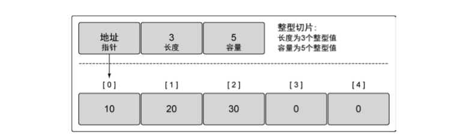

这 3 个字段分别是指向底层数组的指针、切片访问的元素的个数（即长度）和切片允许增长到的元素个数（即容量）。

### 创建和初始化

Go 语言中有几种方法可以创建和初始化切片。是否能提前知道切片需要的容量通常会决定要如何创建切片。

1.	**make 和切片字面量**: 一种创建切片的方法是使用内置的 make 函数。当使用 make 时，需要传入一个参数，指定切片的长度。

	> 使用长度声明一个字符串切片

	```
	// 创建一个字符串切片
	// 其长度和容量都是 5 个元素
	slice := make([]string, 5)
	```

	如果只指定长度，那么切片的容量和长度相等。

	> 使用长度和容量声明整形切片

	```
	// 创建一个整型切片
	// 其长度为 3 个元素，容量为 5 个元素
	slice := make([]int, 3, 5)
	```

	分别指定长度和容量时，创建的切片，底层数组的长度是指定的容量，但初始化后并不能访问所有的数组元素。以上代码中的切片可以访问 3 个元素，而
	底层数组拥有 5 个元素。剩余的 2 个元素可以在后期操作中合并到切片，可以通过切片访问这些元素。如果基于这个切片创建新的切片，新切片会和原
	有切片共享底层数组，也能通过后期操作来访问多余容量的元素。

	不允许创建容量小于长度的切片。

	另一种常用的创建切片的方法是使用切片字面量。这种方法和创建数组类似，只是不需要指定`[]`运算符里的值。初始的长度和容量会基于初始化时提供的
	元素的个数确定。

	> 通过切片字面量来声明切片

	```
	// 创建字符串切片
	// 其长度和容量都是 5 个元素
	slice := []string{"Red", "Blue", "Green", "Yellow", "Pink"}

	// 创建一个整型切片
	// 其长度和容量都是 3 个元素
	slice := []int{10, 20, 30}
	```

	当使用切片字面量时，可设置初始长度和容量。要做的就是在初始化时给出所需的长度和容量作为索引。	

	> 使用索引声明切片

	```
	// 创建字符串切片
	// 使用空字符串初始化第 100 个元素
	slice := []string{99: ""}
	```

	如果在`[]`运算符里指定了一个值，那么创建的就是数组而不是切片。只有不指定值的时候，才会创建切片。

	> 声明数组和声明切片的不同

	```
	// 创建有 3 个元素的整型数组
	array := [3]int{10, 20, 30}

	// 创建长度和容量都是 3 的整型切片
	slice := []int{10, 20, 30}
	```

2.	**nil 和空切片**: 有时，程序可能需要声明一个值为 nil 的切片（也称 nil 切片）。只要在声明时不做任何初始化，就会创建一个 nil 切片。

	> 创建 nil 切片

	```
	var slice []int
	```

	在 Go 语言里，nil 切片是很常见的创建切片的方法。nil 切片可以用于很多标准库和内置函数。在需要描述一个不存在的切片时，nil 切片会很好用。
	例如，函数要求返回一个切片但是发生异常的时候（见下图）。

	利用初始化，通过声明一个切片可以创建一个空切片。

	> 声明空切片

	```
	// 使用 make 创建空的整型切片
	slice := make([]int, 0)

	// 使用切片字面量创建空的整型切片
	slice := []int{}
	```

	空切片在底层数组包含 0 个元素，也没有分配任何存储空间。想表示空集合时空切片很有用，例如，数据库查询返回 0 个查询结果时（如下图）。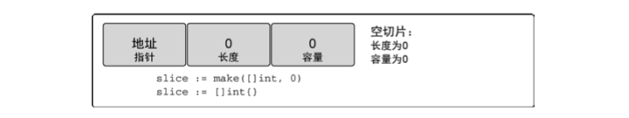

	不管是使用 nil 切片还是空切片，对其调用内置函数 append、len 和 cap 的效果都是一样的。

### 使用切片

1.	**赋值和切片**: 对切片里某个索引指向的元素赋值和对数组里某个索引指向的元素赋值的方法完全一样。

	> 使用切片字面量来声明切片

	```
	// 创建一个整型切片
	// 其容量和长度都是 5 个元素
	slice := []int{10, 20, 30, 40, 50}

	// 改变索引为 1 的元素的值
	slice[1] = 25
	```

	切片之所以被称为切片，是因为创建一个新的切片就是把底层数组切出一部分。

	> 使用切片创建切片

	```
	// 创建一个整型切片
	// 其长度和容量都是 5 个元素
	slice := []int{10, 20, 30, 40, 50}

	// 创建一个新切片
	// 其长度为 2 个元素，容量为 4 个元素
	newSlice := slice[1:3]
	```

	执行以上代码中的切片动作后，有了两个切片，它们共享同一段底层数组，但通过不同的切片会看到底层数组的不同部分（见下图）。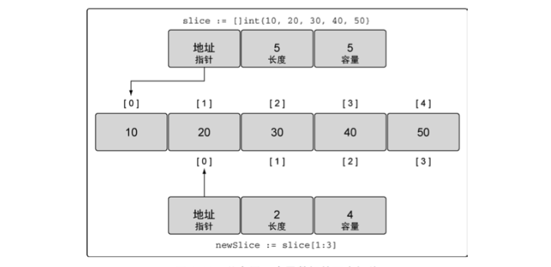

	第一个切片 slice 能够看到底层数组全部 5 个元素的容量，不过之后的 newSlice 就看不到。对于 newSlice，底层数组的容量只有 4 个元素。newSlice 
	无法访问到它所指向的底层数组的第一个元素之前的部分。所以，对 newSlice 来说，之前的那些元素就是不存在的。

	> 如何计算长度和容量

	```
	对于底层数组容量是 k 的切片 slice[i:j] 来说

	长度：j - i
	容量：k - i
	```

	需要记住的是，现在两个切片共享同一个底层数组。如果一个切片修改了该底层数组的共享部分，另一个切片也能感知到。

	> 修改切片内容可能导致的结果

	```
	// 创建一个整型切片
	// 其长度和容量都是 5 个元素
	slice := []int{10, 20, 30, 40, 50}

	// 创建一个新切片
	// 其长度是 2 个元素，容量是 4 个元素
	newSlice := slice[1:3]

	// 修改 newSlice 索引为 1 的元素
	// 同时也修改了原来的 slice 的索引为 2 的元素
	newSlice[1] = 35
	```

	切片只能访问到其长度内的元素。试图访问超出其长度的元素将会导致语言运行时异常。

2.	**切片增长**: 相对于数组而言，使用切片的一个好处是，可以按需增加切片的容量。Go 语言内置的 append 函数会处理增长长度时的所有操作细节。
	
	append 函数总会增加新切片的长度，而容量有可能会改变，也可能不会改变，这取决于被操作的切片的可用容量。

	> 使用 append 向切片增加元素

	```
	// 创建一个整型切片
	// 其长度和容量都是 5 个元素
	slice := []int{10, 20, 30, 40, 50}

	// 创建一个新切片
	// 其长度为 2 个元素，容量为 4 个元素
	newSlice := slice[1:3]

	// 使用原有的容量来分配一个新元素
	// 将新元素赋值为 60
	newSlice = append(newSlice, 60)
	```

	以上代码 append 操作后，两个切片和底层数组的布局如图所示。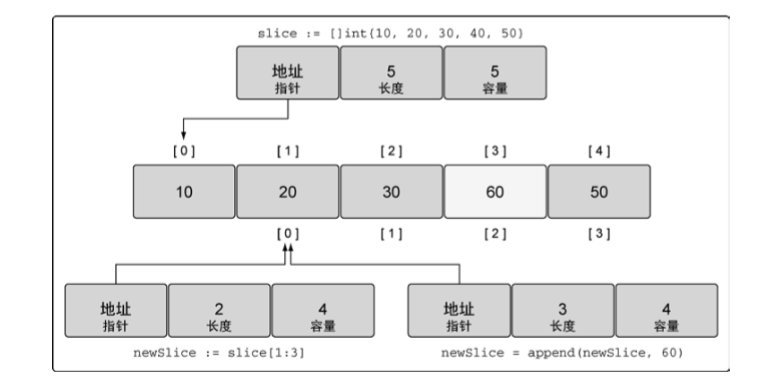

	因为 newSlice 在底层数组里还有额外的容量可用，append 操作将可用的元素合并到切片的长度，并对其进行赋值。由于和原始的 slice 共享同一个底层
	数组，slice 中索引为 3 的元素的值也被改动了。

	如果切片的底层数组没有足够的可用容量，append 函数会创建一个新的底层数组，将被引用的现有的值复制到新数组里，再追加新的值。

	> 使用 append 同时增加切片的长度和容量

	```
	// 创建一个整型切片
	// 其长度和容量都是 4 个元素
	slice := []int{10, 20, 30, 40}

	// 向切片追加一个新元素
	// 将新元素赋值为 50
	newSlice := append(slice, 50)
	```

	当这个 append 操作完成后，newSlice 拥有一个全新的底层数组，这个数组的容量是原来的两倍（见下图）。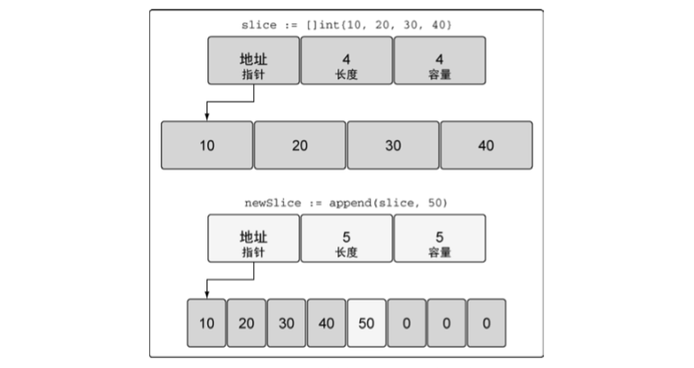
	函数 append 会智能地处理底层数据的容量增长。在切片的容量小于 1000 个元素时，总是会成倍地增加容量。一旦元素个数超过 1000，容量的增长因子
	会设为 1.25，也就是会每次增加 25% 的容量。随着语言的演化，这种增长算法可能会有所改变。

3.	**创建切片时的 3 个索引**: 在创建切片时，还可以使用之前没有提及的第三个索引选项。第三个索引可以用来控制新切片的容量。其目的并不是要增加容
	量，而是要限制容量。可以看到，允许限制新切片的容量为底层数组提供了一定的保护，可以更好地控制追加操作。

	> 使用切片字面量声明一个字符串切片

	```
	// 创建字符串切片
	// 其长度和容量都是 5 个元素
	source := []string{"Apple", "Orange", "Plum", "Banana", "Grape"}
	```

	> 使用 3 个索引创建切片

	```
	// 将第三个元素切片，并限制容量
	// 其长度为 1 个元素，容量为 2 个元素
	slice := source[2:3:4]
	```

	这个切片操作执行后，新切片里从底层数组引用了 1 个元素，容量是 2 个元素。具体来说，新切片引用了 Plum 元素，并将容量扩展到 Banana 元素
	（如下图）。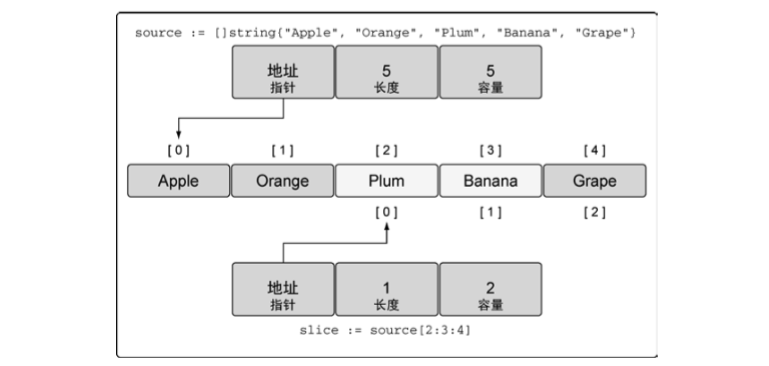

	如果试图设置的容量比可用的容量还大，就会得到一个语言运行时错误。

	> 设置长度和容量一样的好处

	```
	// 创建字符串切片
	// 其长度和容量都是 5 个元素
	source := []string{"Apple", "Orange", "Plum", "Banana", "Grape"}

	// 对第三个元素做切片，并限制容量
	// 其长度和容量都是 1 个元素
	slice := source[2:3:3]

	// 向 slice 追回新字符串
	slice = append(slice, "Kiwi")
	```

	如果不加第三个索引，由于剩余的所有容量都属于 slice，向 slice 追回 Kiwi 会改变原有底层数组索引为 3 的元素值 Banana。不过以上代码限制了
	slice 的容量为 1。当对 slice 调用 append 时，会创建一个新的底层数组，这个数组包括 2 个元素，并将水果 Plum 复制进来，再追回新水果 Kiwi，
	最后返回一个引用了这个底层数组的新切片，如下图。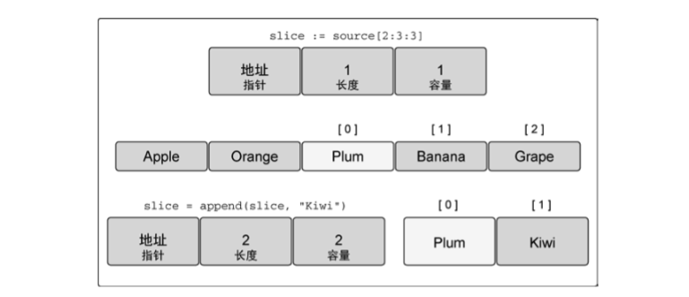

	内置 append 函数是一个可变参数的函数。如果使用`...`运算符，可以将一个切片的所有元素追加到另一个切片里。

	> 将一个切片追加到另一个切片

	```
	// 创建两个切片，并分别用两个整数进行初始化
	s1 := []int{1, 2}
	s2 := []int{3, 4}

	// 将两个切片追加在一起，并显示结果
	fmt.Printf("%v\n", append(s1, s2...))
	```

4.	**迭代切片**: Go 语言有个特殊的关键字 range，它可以配合关键字 for 来迭代切片里的元素。

	> 使用 for range 迭代切片

	```
	// 创建一个整型切片
	// 其长度和容量都是 4 个元素
	slice := []int{10, 20, 30, 40}

	// 迭代每一个元素，并显示其值
	for index, value := range slice {
		fmt.Printf("Index: %d Value: %d\n", index, value)
	}
	```

	当迭代切片时，关键字 range 会返回两个值。第一个值是当前迭代到的索引位置，第二个值是该位置对应元素值的一份副本（见下图）。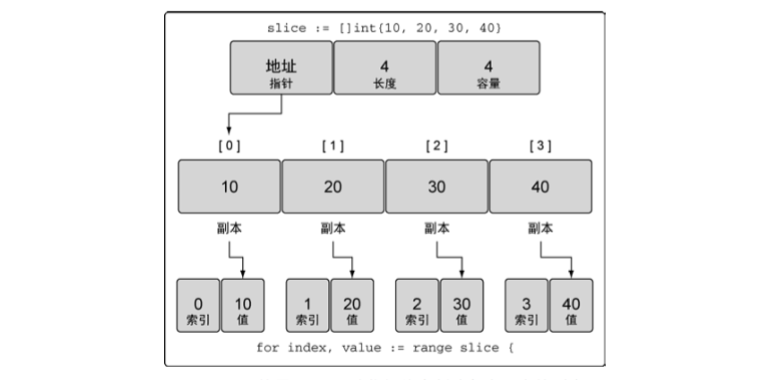

	需要强调的是，range 创建了每个元素的副本，而不是直接返回对该元素的引用。如下，如果使用该值变量的地址作为指向每个元素的指针，就会造成错误。

	> range 提供了每个元素的副本

	```
	// 创建一个整型切片
	// 其长度和容量都是 4 个元素
	slice := []int{10, 20, 30, 40}

	// 迭代每个元素，并显示值和地址
	for index, value := range slice {
		fmt.Printf("Value: %d Value-Addr: %X ElemAddr: %X\n", value, &value, &slice[index])
	}

	Output:
	Value: 10 Value-Addr: 10500168 ElemAddr: 1052E100
	Value: 20 Value-Addr: 10500168 ElemAddr: 1052E104
	Value: 30 Value-Addr: 10500168 ElemAddr: 1052E108
	Value: 40 Value-Addr: 10500168 ElemAddr: 1052E10C
	```

	因为迭代返回的变量是一个迭代过程中根据切片依次赋值的新变量，所以 value 的地址总是相同的，要想获取每个元素的地址，可以使用切片变量和索引值。

	如果不需要索引值，可以使用点位字符来忽略这个值。

	> 使用空白标识符（下划线）来忽略索引值

	```
	// 创建一个整型切片
	// 其长度和容量都是 4 个元素
	slice := []int{10, 20, 30, 40}

	// 迭代每个元素，并显示其值
	for _, value := range slice {
		fmt.Printf("Value: %d\n", value)
	}
	```

	> 使用传统的 for 循环对切片进行迭代

	```
	// 创建一个整型切片
	// 其长度和容量都是 4 个元素
	slice := []int{10, 20, 30, 40}

	// 从第三个元素开始迭代每个元素
	for index := 2; index < len(slice); index ++ {
		fmt.Printf("Index: %d Value: %d\n", index, slice[index])
	}
	```

	有两个特殊的内置函数 len 和cap，可用于处理数组、切片和通道。对于切处，函数 len 返回切片的长度，函数 cap 返回切片的容量。

### 多维切片

和数组一样，切片是一维的。不过，和之前对数组的讨论一样，可以组合多个切片形成多维切片。

> 声明多维切片

```
// 创建一个整型切片的切片
slice := [][]int{{10}, {100, 200}}
```

这样有了一个包含两个元素的外层切片，每个元素包含一个内层的整形切片。切片 slice 的值看起来像下图的样子。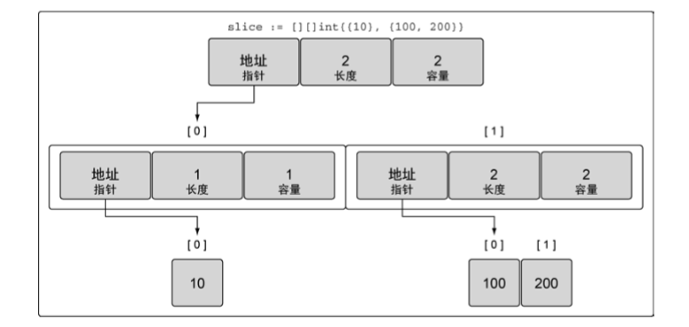
可以看到组合切片的操作是如何将一个切片嵌入到另一个切片中的。外层的切片包括两个元素，每个元素都是一个切片。第一个元素中的切片使用单个整数
10 来初始化，第二个元素中的切片包括两个整数，即 100 和 200。

这种组合可以让用户创建非常复杂且强大的数据结构。

> 组合切片的切片

```
// 创建一个整型切片的切片
slice := [][]int{{10}, {100, 200}}

// 为第一个切片追加值为 20 的元素
slice[0] = append(slice[0], 20)
```

Go 语言里使用 append 函数处理追加的方式很简明：先增长切片，再将新的整型切片赋值给外层切片的第一个元素。当以上代码操作完成后，会为新的整型
切片分配新的底层数组，然后将切片复制到外层切片的索引为 0 的元素，如下图。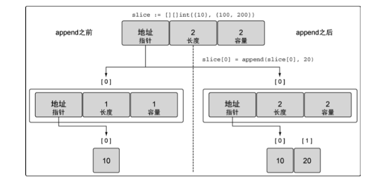

即使是这么简单的多维切片，操作时也会涉及众多布局和值。看起来在函数间像这样传递数据结构也会很复杂。不过切片本身结构简单，可以以很小的成本
在函数间传递。

### 在函数间传递切片

在函数间传递切片就是要在函数间以值的方式传递切片。由于切片的尺寸很小，在函数间复制和传递切片成本也很低。

> 在函数间传递切片

```
// 分配包含 100 万个整型值的切片
slice := make([]int, 1e6)

// 将 slice 传递到函数 foo
slice = foo(slice)

// 函数 foo 接收一个整形切片，并返回这个切片
func foo(slice []int) []int {
	...
	return slice
}
```

在 64 位架构的机器上，一个切片需要 24 个字节的内存：指针字段需要 8 字节，长度和容量字段分别需要 8 字节。由于与切片关联的数据包含在底层数组
里，不属于切片本身，所以将切片复制到任意函数的时候，对底层数组大小都不会有影响。复制时只会复制切片本身，不会涉及底层数组，如图。

在函数间传递 24 字节的数据会非常快速、简单。这也是切片效率高的地方。不需要传递指针和处理复杂的语法，只需要复制切片，按想要的方式修改数据，
然后传递回一份新的切片副本。

## 映射的内部实现和基础功能

映射是一种数据结构，用于存储一系列无序的键值对。映射里基于键来存储值。映射功能强大的地方是，能够基于键快速检索数据。键就像索引一样，指向与
该键关联的值。下图展示了映射里键值对是如何存储的。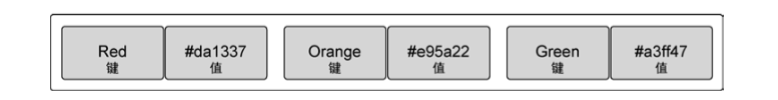

### 内部实现(TODO: 这里完全看不懂……未完待续)

映射是一个集合，可以使用类似处理数组和切片的方式迭代映射中的元素。但映射是无序的集合，意味着没有办法预测键值对被返回的顺序。即使使用同样的
顺序保存键值对，每次迭代映射的时候顺序也可能不一样。无序的原因是映射的实现使用散列表，如图。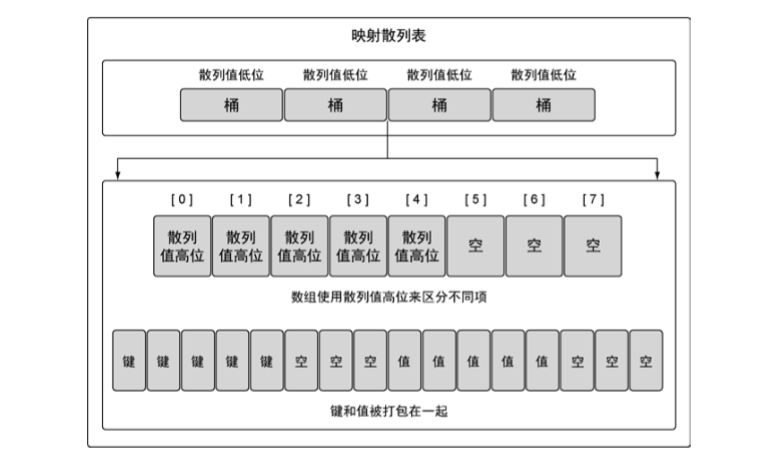

映射的散列表包含一组桶。在存储、删除或者查找键值对的时候，所有操作都要先选择一个桶。把操作映射时指定的键传给映射的散列函数，就能选中对应
的桶。这个散列函数的目的是生成一个索引，这个索引最终将键值对分布到所有可用的桶里。

随着映射存储的增加，索引分布越均匀，访问键值对的速度就越快。

### 创建和初始化

Go 语言有很多种方法可以创建并初始化映射，可以使用内置的 make 函数，也可以使用映射字面量。

> 使用 make 声明映射

```
// 创建一个映射，键的类型是 string，值的类型是 int
dict := make(map[string]int)

// 创建一个映射，键和值的类型都是 string
// 使用两个键值对初始化映射
dict := map[string]string{"Red": "#da1337", "Orange": "#e95a22"}
```

创建映射时，更常用的方法是使用映射字面量。映射的初始长度会根据初始化时指定的键值对的数量来确定。映射的键可以是任何值。这个值的类型可以是内置
的类型，也可以是结构类型，只要这个值可以使用`==`运算符做比较。切片、函数以及包含切片的结构类型这些类型由于具有引用语义，不能作为映射的键。

> 声明一个存储字符串切片的映射

```
// 创建一个映射，使用字符串切片作为值
dict := map[int][]string{}
```

### 使用映射

> 为映射赋值

```
// 创建一个空映射，用来存储颜色以及颜色对应的十六进制代码
colors := map[string]string{}

// 将 Red 的代码加入到映射
colors["Red"] = "#da1337"
```

可以通过声明一个未初始化的映射来创建一个值为 nil 的映射（称为 nil 映射）。nil 映射不能用于存储键值对，否则，会产生一个语言运行时错误。

> 对 nil 映射赋值时的语言运行时错误

```
// 通过声明映射创建一个 nil 映射
var colors map[string]string

// 将 Red 的代码加入到映射
colors["Red"] = "#da1337"

Runtime Error:
panic: runtime error: assignment to entry in nil map
```

测试映射里是否存在某个键是映射的一个重要操作。这个操作允许用户写一些逻辑来确定是否完成了某个操作或者是否在映射里缓存了特定数据。这个操作也可
以用来比较两个映射，来确定哪些键值对互相匹配，哪些键值对不匹配。

从映射取值时有两个选择。第一个选择是，可以同时获得值，以及一个表示这个键是否存在的标志。

> 从映射获取值并判断键是否存在

```
// 获取键 Blue 对应的值
value, exists := colors["Blue"]

// 这个键存在吗？
if exists {
	fmt.Println(value)
}
```

另一个选择是，只返回键对应的值，然后通过判断这个值是不是零值来确定键是否存在，**但是，这种方法只能用在映射存储的值都是非零值的情况。**

> 从映射获取值，并通过该值判断键是否存在

```
// 获取键 Blue 对应的值
value := colors["Blue"]

// 这个键存在吗？
if value != "" {
	fmt.Println(value)
}
```

在 Go 语言里，通过键来索引映射时，即使这个键不存在也总会返回一个值。在这种情况下，返回的是该值对应的类型的零值。

迭代映射里的所有值和迭代数组或切片一样，使用关键字 range。

> 使用 range 迭代映射

```
colors := map[string]string{
	"AliceBlue": "#f0f8ff",
	"Coral": "#ff7f50",
	"DardGray": "#a9a9a9",
	"ForestGreen": "#228b22",
}

for key, value := range colors {
	fmt.Printf("Key: %s Value: %s\n", key, value)
}
```

如果想把一个键值对从映射里删除，就使用内置的 delete 函数。

> 从映射中删除一项

```
// 删除键为 Coral 的键值对
delete(colors, "Coral")

// 显示映射里的所有颜色
for key, value := range colors {
	fmt.Printf("Key: %s Value: %s\n", key, value)
}
```

### 在函数间传递映射

在函数间传递映射并不会制造出该映射的一个副本。实际上，当传递映射给一个函数，并对这个映射做了修改时，所有对这个映射的引用都会察觉到这个修改。

> 在函数间传递映射

```
func main() {
	// 创建一个映射时，存储颜色以及颜色对应的十六进制代码
	colors := map[string]string{
		"AliceBlue": "#f0f8ff",
		"Coral": "#ff7F50",
		"DardGray": "#a9a9a9",
		"ForestGreen": "#228b22",
	}

	// 显示映射里的所有颜色
	for key, value := range colors {
		fmt.Printf("Key: %s Value: %s\n", key, value)
	}

	// 调用函数来移除指定的键
	removeColor(colors, "Coral")

	// 显示映射里的所有颜色
	for key, value := range colors {
		fmt.Printf("Key: %s Value: %s\n", key, value)
	}
}

func removeColor(colors map[string]string, key string) {
	delete(colors, key)
}
```

这个特性和切片类似，保证可以用很小的成本来复制映射。
