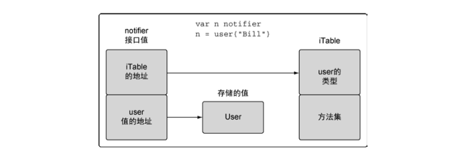
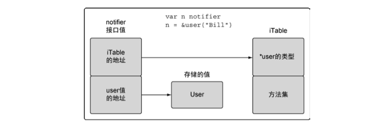

# Go 语言的类型系统

Go 语言是一种静态类型的编程语言。这意味着，编译器需要在编译时知晓程序里每个值的类型。如果提前知道类型信息，编译器就可以确保程序合理地使用值。
这有助于减少潜在的内存异常和 bug，并且使编译器有机会对代码进行一些性能优化，提高执行效率。

值的类型给编译器提供两部分信息：第一部分，需要分配多少内存给这个值（即值的规模）；第二部分，这段内存表示什么。对于许多内置类型的情况来说，规
模和表示是类型名的一部分。

## 用户定义的类型

Go 语言允许用户定义类型。当用户声明一个新类型时，这个声明就给编译器提供了一个框架，告知必要的内存大小和表示信息。声明后的类型与内置类型的运作
方式类似。Go 语言里声明用户定义的类型有两种方法。最常用的方法是使用关键字 struct，它可以让用户创建一个结构类型。

> 声明一个结构类型

```
type user struct {
	name		string
	email		string
	ext			int
	privileged	bool
}
```

可以看到，这个结构类型的声明以关键字 type 开始，之后是新类型的名字，最后是关键字 struct。

> 使用结构类型声明变量，并初始化为其零值

```
// 声明 user 类型的变量
var bill user
```

关键字 var 创建了类型为 user 且名为 bill 的变量。当声明变量时，这个变量对应的值总是会被初始化。这个值要么用指定的值初始化，要么用零值（即变量
类型的默认值）做初始化。

还可以使用短变量声明操作符。这个操作符是冒号加一个等号`:=`。一个短变量声明操作在一次操作中完成两件事情：声明一个变量，并初始化。短变量声明操作
符会使用右侧给出的类型信息作为声明变量的类型。

> 使用结构字面量来声明一个结构类型的变量

```
// 声明 user 类型的变量，并初始化所有字段
lisa := user{
	name: "Lisa",
	email: "lisa@email.com",
	ext: 123,
	privileged: true,
}
```

结构字面量可以对结构类型采用两种形式。以上形式在不同行声明每个字段的名字以及对应的值。字段名与值用冒号分隔，每一行以逗号结尾。这种形式对字段
的声明顺序没有要求。第二种形式没有字段名，只声明对应的值。

> 不使用字段名，创建结构类型的值

```
lisa := user{"Lisa", "lisa@email.com", 123, true}
```

这种形式下，值的顺序很重要，必须要和结构声明中字段的顺序一致。当声明结构类型时，字段的类型并不限制在内置类型，也可以使用其他用户定义的类型。

> 使用其他结构类型声明字段

```
// admin 需要一个 user 类型作为管理者，并附加权限
type admin struct {
	person user
	level string
}
```

以上代码展示了一个名为 admin 的新结构类型。这个结构类型有一个名为 person 的 user 类型的字段，还声明了一个名为 level 的 string 字段。当创建具
有 person 这种字段的结构类型的变量时，初始化用的结构字面量会有一些变化。

> 使用结构字面量来创建字段的值

```
// 声明 admin 类型的变量
fred := admin{
	person: user{
		name: "Lisa",
		email: "lisa@email.com",
		ext: 123,
		privileged: true,
	},
	level: "super",
}
```

为了初始化 person 字段，需要创建一个 user 类型的值。

另一种声明用户定义的类型的方法是，基于一个已有的类型，将其作为新类型的类型说明。标准库使用这种声明类型的方法，从内置类型创建出很多更加明确的
类型，并赋予更高级的功能。

> 基于 int64 声明一个新类型

```
type Duration int64
```

以上展示的是标准库的 time 包里的一个类型的声明。Duration 是一种描述时间间隔的类型，单位是纳秒(ns)。这个类型使用内置的 int64 类型作为表示。
在 Duration 类型的声明中，我们把 int64 类型叫作 Duration 的基础类型。不过，虽然 int64 是基础类型，Go 并不认为 Duration 和 int64 是同一种类型。
这两个类型是完全不同的有区别的类型。换句话说，虽然 int64 类型是基础类型，Duration 类型依然是一个独立的类型。两种不同类型的值即使互相兼容，也不
能互相赋值。编译器不会对不同类型的值做隐式转换。

## 方法

方法能给用户定义的类型添加新的行为。方法实际上也是函数，只是在声明时，在关键字 func 和方法名之间增加了一个参数。

[listing11.go](listing11.go)

以上代码展示了两种类型的方法。关键字 func 和函数名之间的参数被称作**接收者**，将函数与接收者的类型绑在一起。如果一个函数有接收者，这个函数就
被称为**方法**。

Go 语言里有两种类型的接收者：**值接收者**和**指针接收者**。如果使用值接收者声明方法（[listing11.go](listing11.go)的第 15 行），调用时会使用
这个值的一个副本来执行。调用方法的语法与调用一个包里的函数看起来很类似（[listing11.go](listing11.go)的第 32 行）。在调用 notify 方法时，使用
bill 的值作为接收者进行调用，方法 notify 会接收到 bill 的值的一个副本。

也可以使用指针来调用使用值接收者声明的方法（[listing11.go](listing11.go)的第 37 行）。为了支持这种方法调用，Go 语言调整了指针的值，来符合方法
接收者的定义。可以认为 Go 语言执行了以下代码所示的操作。

> Go 在代码背后的执行操作

```
*(lisa).notify()
```

以上代码展示了 Go 编译器为了支持这种方法调用背后做的事情。指针被解引用为值，这样就符合了值接收者的要求。同样的，notify 操作的也是一个副本。

也可以使用指针接收者声明方法（[listing11.go](listing11.go)的第 23 行）。这个接收者的类型是指向 user 类型值的指针，而不是 user 类型的值。当调
用使用指针接收者声明方法时，这个方法会共享调用方法时接收者所指向的值（[listing11.go](listing11.go)的第 36 行）。

**值接收者使用值的副本来调用方法，而指针接收者使用实际值来调用方法。**

也可以使用一个值来调用使用指针接收者声明的方法（[listing11.go](listing11.go)的第 41 行）。Go 语言再一次对值做了调整，使之符合函数的接收者，
进行调用。

> Go 在代码背后的执行动作

```
(&bill).changeEmail("bill@newdomain.com")
```

以上代码展示了 Go 编译器为了支持这种方法调用在背后做的事情。首先引用 bill 值得到一个指针，这样这个指针就能够匹配方法的接收者类型，再进行
调用。Go 语言既允许使用值，也允许使用指针来调用方法，不必严格符合接收者的类型。

## 类型的本质

类型的本质是什么？

如果给这个类型增加或者删除某个值，是要创建一个新值，还是要更改当前的值？如果是要创建一个新值，该类型的方法就使用值接收者。如果是要修改当
前值，就使用指针接收者。这个答案也会影响程序内部传递这个类型的值的方式：是按值做传递，还是按指针做传递。保持传递的一致性很重要。这个背后的
原则是，不要只关注某个方法是如何处理这个值，而是要关注这个值的本质是什么。

### 内置类型

内置类型是由语言提供的一组类型，分别有数值类型、字符串类型和布尔类型。这些类型本质上是原始的类型。因此，当对这些值进行增加或者删除时，会
创建一个新值。基于这个结论，当把这些类型的值传递给方法或者函数时，应该传递一个对应值的副本。来看一下标准库里使用这里内置类型的值的函数。

> golang.org/src/strings/strings.go

```
func Trim(s string, cutset string) string {
	if s == "" || cutset == "" {
		return s
	}
	return TrimFunc(s, makeCutsetFunc(cutset))
}
```

Trim 函数对调用者原始的 string 值的一个副本做操作，并返回一个新的 string 值的副本。字符串(string)就像整数、浮点数和布尔值一样，本质上是一
种很原始的数据值，所以在函数或方法内外传递时，要传递字符串的一份副本。

再看一下体现内置类型具有的原始本质的第二个例子。

> golang.org/src/os/env.go

```
func isShellSpecialVar(c uint8) bool {
	switch c {
		case '*', '#', '$', '@', '!', '?', '0', '1', '2', '3', '4', '5', '6', '7', '8', '9':
			return true
	}
	return false
}
```

这里的参数没有使用指针来共享参数的值或者返回值。调用者传入了一个 uint8 值的副本，并接受一个返回值 true 或者 false。

### 引用类型

Go 语言里的引用类型有如下几个：切片、映射、通道、接口和函数类型。当声明上述类型的变量时，创建的变量被称作**标头(header)**值。从技术细节上
说，字符串也是一种引用类型。每个引用类型创建的标头值是包含一个指向底层数据结构的指针。每个引用类型还包含一组独特的字段，用于管理底层数据
结构。因为标头值是为复制而设计的，所以永远不需要共享一个引用类型的值。标头值里包含一个指针，因此通过复制来传递一个引用类型的值的副本，本
质上就是在共享底层数据结构。

来看一下 net 包里的类型。

> golang.org/src/net/ip.go

```
type IP []byte
```

以上代码展示了一个名为 IP 的类型，这个类型被声明为字节切片。当要围绕想着的内置类型或者引用类型来声明用户定义的行为时，直接基于已有类型来
声明用户定义的类型会很好用。编译器只允许为全名的用户定义的类型声明方法。

> golang.org/src/net/ip.go

```
func (ip IP) MarchalText() ([]byte, error) {
	if len(ip) == 0 {
		return []byte(""), nil
	}
	if len(ip) != IPv4len && len(ip) != IPv6len {
		return nil, errors.New("invalid IP address")
	}
	return []byte(ip.String()), nil
}
```

MarshalText 方法是用 IP 类型的值接收者声明的。一个值接收者，正如预期的通过复制来传递引用，从而不需要通过指针来共享引用类型的值。这种传递
方法也可以应用到函数或者方法的参数传递。

> golang.org/src/net/ip.go

```
// ipEmptyString 像 ip.String 一样，
// 只不过在没有设置 ip 时会返回一个空字符串
func ipEmptyString(ip IP) string {
    if len(ip) == 0 {
        return "" 
    }
    return ip.String()
}
```

这个函数需要传入一个 IP 类型的值。再一次，可以看到调用者传入的是这个引用类型的值，而不是通过引用共享给这个函数。调用者将引用类型的值的副本传入
这个函数。最后要说的是，引用类型的值在其他方面像原始的数据类型的值一样对待。

### 结构类型

结构类型可以用来描述一组数据值，这组值的本质即可以是原始的，也可以是非原始的。

> golang.org/src/time/time.go

```go
type Time struct {
	// sec 给出自公元 1 年 1 月 1 日 00:00:00
	// 开始的秒数
	sec int64
	
	// nsec 指定了一秒内的纳秒偏移
	// 这个值是非零值
	// 必须在 [0, 999999999] 范围内
	nsec int32
	
	// loc 指定了一个 Location，
	// 用于决定该时间对应的当地的分、小时、
	// 天和年的值
	// 只有 Time 的零值，其 loc 的值是 nil
	// 这种情况下，认为处于 UTC 时区
	loc *Location
}
```

以上是 Time 类型的实现。下面是 Now 函数创建 Time 类型的值。

> golang.org/src/time/time.go

```
func Now() Time {
    sec, nsec := now()
    return Time{sec + unixToInternal, nsec, Local}
}
```

这个函数创建了一个 Time 类型的值，并给调用者返回了 Time 值的副本。这个函数没有使用函数指针来共享 Time 值。

> golang.org/src/time/time.go

```go
func (t Time) Add(d Duration) Time {
	t.sec += int64(d / 1e9)
	nsec := int32(t.nsec) + int32(d % 1e9)
	if nsec >= 1e9 {
		t.sec ++
		nsec -= 1e9
	} else if nsec < 0 {
		t.sec --
		nsec += 1e9
	}
	t.nsec = nsec
	return t
}
```

## 接口

多态是指代码可以根据类型的具体实现采取不同行为的能力。如果一个类型实现了某个接口，所有使用这个接口的地方，都可以支持这种类型的值。标准库里有
很好的例子，如 io 包里实现的流式处理接口。io 包提供了一组构造得非常好的接口和函数，来让代码轻松支持流式数据处理。只要实现两个接口，就能利用整
个 io 包背后的所有强大能力。

先看看标准库的接口例子。

### 标准库

示例程序实现了流行程序 curl 的功能，[listing34.go](listing34.go)。该代码展示了接口的能力以及在标准库里的应用。在与服务器成功通信后，http.Get
函数会返回一个 http.Response 类型的指针。http.Response 类型包含一个名为 Body 的字段，这个字段是一个 io.ReadCloser 接口类型的值。

Body 字段作为第二个参数传给 io.Copy 函数，io.Copy 函数的第二个参数，接受一个 io.Reader 接口类型的值，这个值表示数据流入的源。Body 字段实现了
io.Reader 接口，因为可以将 Body 字段传入 io.Copy，使用 web 服务器的返回内容作为源。

io.Copy 的第一个参数是复制到的目标，这个参数必须是一个实现了 io.Writer 接口的值。对于这个目标，传入了 os 包里的一个特殊值 Stdout。这个接口值
表示标准输出设备，并且已经实现了 io.Writer 接口。当将 Body 和 Stdout 这两个值传给 io.Copy 函数后，这个函数会把服务器的数据分成小段，源源不断
地传给终端窗口，走到最后一个片段读取并写入终端，io.Copy 函数才返回。

io.Copy 函数可以以这种工作流的方式处理很多标准库里已有的类型，如代码 [listing35.go](listing35.go)。这个程序使用接口来拼接字符串，并将数据以流
的方式输出到标准输出设备。

fmt.Fprintf 函数接受一个 io.Writer 类型的接口值作为其第一个参数。由于 bytes.Buffer 类型的指针实现了 io.Writer 接口，所以可以将缓存 b 传入
fmt.Fprintf 函数，并执行追加操作。最后，使用 io.Copy 函数，将字符写到终端窗口。由于 bytes.Buffer 类型的指针也实现了 io.Reader 接口，io.Copy
函数可以用于在终端窗口显示缓冲区 b 的内容。

### 实现

接口是用来定义行为的类型。这些被定义的行为不由接口直接实现，而是通过方法由用户定义的类型实现。如果用户定义的类型实现了某个接口类型声明的一组
方法，那么这个用户定义的类型的值就可以赋给这个接口类型的值。这个赋值会把用户定义的类型的值存入接口类型的值。

对接口值方法的调用会执行接口值里存储的用户定义的类型的值对应的方法。因为任何用户定义的类型都可以实现任何接口，所以对接口值方法的调用自然就是
一种多态。在这个关系里，用户定义的类型通常叫作**实体类型**，原因是如果离开内部存储的用户定义的类型的值的实现，接口值并没有具体的行为。

下图展示了在 user 类型值赋值后接口变量的值的内部布局。接口值是一个两个字长度的数据结构，第一个字包含一个指向内部表的指针。这个内部表叫作 iTable，
包含了所存储的值的类型信息。iTable 包含了已存储的值的类型信息以及与这个值相关联的一组方法。第二个字是指向所存储值的指针。将类型信息和指针组合
在一起，就将这两个值组成了一种特殊的关系。

下图展示了一个指针赋值给接口之后发生的变化。在这种情况里，类型信息会存储一个指向保存的类型的指针，而接口值第二个字依旧保存指向实体值的指针。

### 方法集

方法集定义了接口的接受规则，代码 [listing36.go](listing36.go) 所示的代码，有助于理解方法集在接口中的重要角色。

方法集定义了一组关联到给定类型的值或者指针的方法。定义方法时使用的接收者的类型决定了这个方法是关联到值还是关联到指针，还是两个都关联。Go 语言
规范里定义的方法集的规则如下：

| Values | Methods Receivers |
|:-- | :-- |
| `T` | `(t T)` |
| `*T` | `(t T) and (t *T)` |

以上展示了规范里对方法集的描述。描述中说到，T 类型的值的方法集只包含值接收者声明的方法。而指向 T 类型的指针的方法集既包含值接收者声明的方法，
也包含指针接收者声明的方法。从值的角度看这些规则，会显得很复杂。下面从接收者的角度来看一下这些规则。

| Methods Receivers | Values |
| :-- | :-- |
| `(t T)` | `T and *T` |
| `(t *T)` | `*T` |

如果使用指针接收者来实现一个接口，那么只有指向那个类型的指针才能够实现对应的接口。如果使用值接收者来实现一个接口，那么那个类型的值和指针都能
够实现对应的接口。为什么会有这种限制？事实上，编译器并不是总能自动获得一个值的地址，如 [listing46.go](listing46.go)。这是不能总是获得值的地址
的一种情况。因为不是总能获取一个值的地址，所以值的方法集只包括了使用值接收者实现的方法。

### 多态

[listing48.go](listing48.go)

以上代码分别声明了 user 和 admin 结构，并均用指针接收者实现了 notifier 接口。sendNotification 函数接受一个实现了 notifier 接口的值作为参数。
既然任意一个实体类型都能实现该接口，那么这个函数可以针对任意实体类型的值来执行 notify 方法。因此，这个函数就能提供多态的行为。

## 嵌入类型

Go 语言允许用户扩展或者修改已有类型的行为。这个功能对代码利用很重要，在修改已有类型以符合新类型的时候也很重要。这个功能是通过**嵌入类型(type embedding)**
完成的。嵌入类型是将已有的类型直接声明在新的结构类型里。被嵌入的类型被称为新的外部类型的内部类型。

通过嵌入类型，与内部类型相关的标识符会提升到外部类型上。这些被提升的标识符就像直接声明在外部类型里的标识符一样，也是外部类型的一部分。这样，
外部类型就组合了内部类型包含的所有属性，并且可以添加新的字段和方法。外部类型也可以通过声明与内部类型标识符同名的标识符来覆盖内部标识符的字段
或者方法。这就是扩展或者修改已有类型的方法。以下示例程序演示了嵌入类型的基本用法，[listing50.go](listingt50.go)。

要嵌入一个类型，只需要声明这个类型的名字就可以了。如上代码，将 user 类型嵌入 admin，就可以说 user 是外部类型 admin 的内部类型。通过内部类型的
名字可以访问内部类型。对外部类型来说，内部类型总是存在的。这就意味着，虽然没有指定内部类型对应的字段名，还是可以使用内部类型的类型名，来访问到
内部类型的值。借助内部类型提升，notify 方法可以直接通过 ad 变量来访问。

修改一下以上代码，加入一个接口，[listing56.go](listing56.go)。有个有趣的地方，外部类型 admin 内部嵌入了 user 类型，而 user 指针实现了 notifier
接口，因此编译器也认为 admin 指针实现了 notifier 接口。由于内部类型的提升，内部类型实现的接口会自动提升到外部类型。这意味着内部类型的实现，外
部类型也同样实现了这个接口。

如果外部类型并不需要使用内部类型的实现，而想使用自己的一套实现，怎么办？接着来看另一个示例，[listing60.go](listing60.go)。

该程序为 admin 类型增加了 notifier 接口的实现。当 admin 类型的实现被调用时，会显示"Sending admin email"，作为对比，user 类型的实现被调用时，
会显示"Sending user email"。该程序表明，如果外部类型实现了 notify 方法，内部类型的实现就不会被提升。不过内部类型的值一直存在，因此还可以通过
直接访问内部类型的值，来调用没有被提升的内部类型实现的方法。

## 公开或未公开的标识符

要想设计出好的 API，需要使用某种规则来控制声明后的标识符的可见性。Go 语言支持从包里公开或者隐藏标识符。通过这个功能，用户能按照自己的规则控制
标识符的可见性。用一个示例来演示如何隐藏包里未公开的标识符，[listing64](listing64)。

以上示例有两个代码文件。一个代码文件名字为 [counters.go](listing64/counters/counters.go)；另一个代码文件名字是 [listing64.go](listing64/listing64.go)，
导入了 counters 包。当要写的代码属于某个包时，好的实践是使用与代码所在文件一样的名字作为包名。在 counters 包里的 alertCounter 标识符的
名字以小写字母开头，因此这个标识符是未公开的，即包外的代码不可见；如果一个标识符的名字以大写字母开头，这个标识符就是公开的，即被包外的代码可见。
当代码试图创建未公开的类型的值，会编译错误，表明这个标识符是未定义的。

在 counters 包里实现了一个工厂函数 New 来创建一个未公开的 alertCounter 类型的值。alertCounter 类型仍旧是未公开的，不过 New 函数
使得 main 函数能够接受一个未公开的 alertCounter 类型的值。要让这个行为可行，需要两个理由：第一，公开或者未公开的标识符，不是一个值；第二，
短变量声明操作符，有能力捕获引用的类型，并创建一个未公开的类型的变量。永远不能显式创建一个未公开的类型的变量，不过短变量声明操作符可以这么做。

再来看一个例子，看看这些可见的规则是如何影响结构里的字段，[listing71](listing71)。该代码中 entities 包中声明了名为 User 的
公开的结构类型，User 类型里声明了两个字段，一个是名为 Name 的公开字段，一个是名为 email 的未公开字段。程序试图初始化未公开的字段 email，编
译器提示这是未知字段，因为未公开字段 email 在 entities 包外不能被访问。

最后一个例子 [listing74](listing74) 展示了公开和未公开的内嵌类型是如何工作的。entities 包包含两个结构类型，一个未公开的结构类型 user，一个公
开的结构类型 Admin。Admin 嵌入了 user 类型。由于内部类型 user 是未公开的，所以无法直接通过结构字面量的方式初始化该内部类型。不过，即使内部类型
是未公开的，内部类型里声明的字段依旧是公开的。既然内部类型的标识符提升到了外部类型，这些公开的字段也可以通过外部类型的字段的值来访问。

