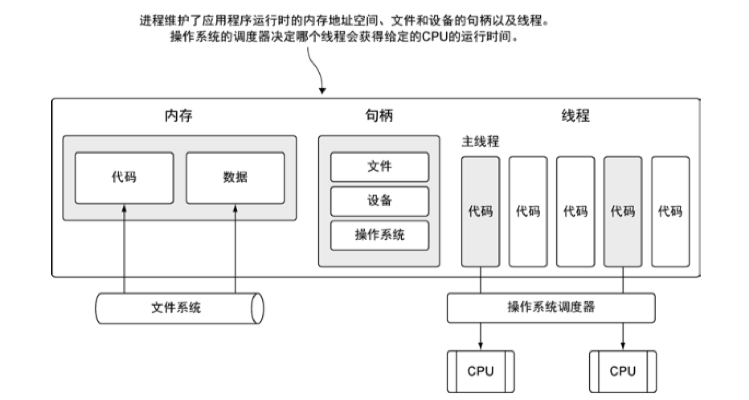
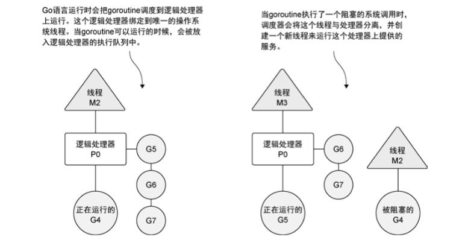
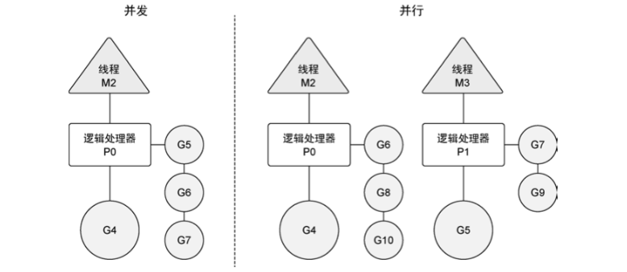
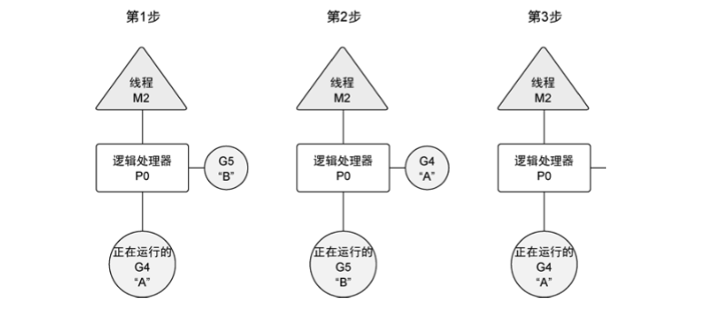
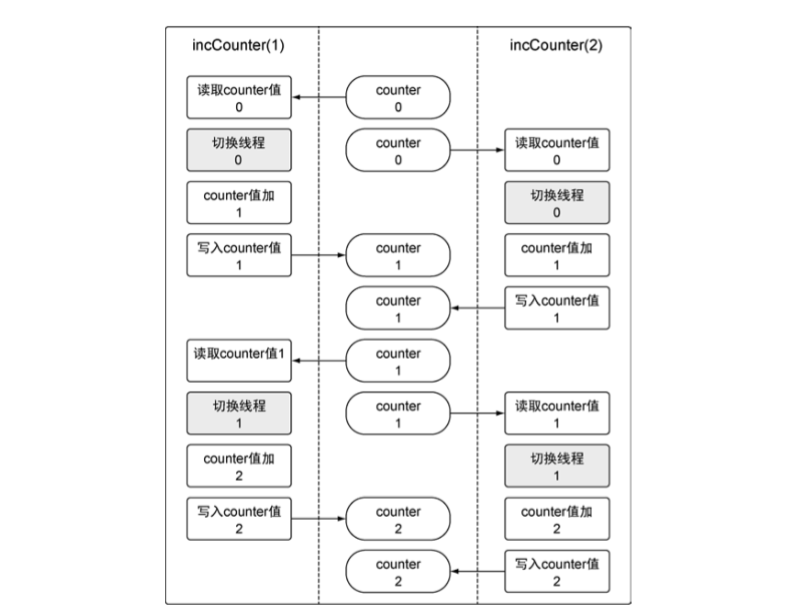

# 并发

Go 语言的语法和运行时直接内置了对并发的支持。

Go 语言里的并发指的是能让某个函数独立于其他函数运行的能力。当一个函数创建为 goroutine 时，Go 会将其视为一个独立的工作单元。这个单元会被调度到
可用的逻辑处理器上执行。Go 语言运行时的调度器是一个复杂的软件，能管理被创建的所有 goroutine 并为其分配执行时间。这个调度器在操作系统之上，将
操作系统的线程与语言运行时的逻辑处理器绑定。调度器在任何给定的时间，都会全面控制哪个 goroutine 要在哪个逻辑处理器上运行。

Go 语言的并发同步模型来自一个叫做**通信顺序进程(Communicating Sequential Processes, CSP)**的范型(paradigm)。CSP 是一种消息传递模型，通过在
goroutine 之间传递数据，而不是对数据进行加锁来实现同步访问。用于在 goroutine 之间同步和传递数据的关键数据类型叫做**通道(channel)**。

## 并发与并行

先来学习一下抽象程序较高的概念：什么是操作系统的**线程(thread)**和**进程(process)**。

当运行一个应用程序时，操作系统会为这个应用程序启动一个进程，可以将这个进程看作一个包含了应用程序在运行中需要用到和维护的各种资源的容器。下图
展示了一个包含所有可能分配的常用资源的进程。

这些资源包括但不限于内存地址空间、文件和设备的句柄以及线程。**一个线程**是一个执行空间，这个空间会被操作系统调度来运行函数中所写的代码。每个
进程至少包含一个线程，每个进程的初始线程被称为**主线程**。因为执行这个线程的空间是应用程序的本身的空间，所以当主线程终止时，应用程序也会终止。
操作系统将线程调度到某个处理器上运行，这个处理器并不一定是进程所在的处理器。

操作系统会在物理处理器上调度线程来运行，而 Go 语言的运行时会在逻辑处理器上调度 goroutine 来运行。每个逻辑处理器都分别绑定到单个操作系统线程。

在下图中，可以看到操作系统线程、逻辑处理器和本地运行队列之间的关系。

如果创建一个 goroutine 并准备运行，这个 goroutine 就会被放到调度器的全局运行队列中。之后，调度器就将这些队列中的 goroutine 分配给一个逻辑处理
器，并放到这个逻辑处理器对应的本地运行队列中。本地运行队列中的 goroutine 会一直等待直到自己被分配的逻辑处理器执行。有时，正在运行的 goroutine 
需要执行一个阻塞的系统调用，如打开一个文件。当这类调用发生时，线程和 goroutine 会从逻辑处理器上分离，该线程会继续阻塞，等待系统调用的返回。与
此同时，这个逻辑处理器就失去了用来运行的线程。所以，调度器会创建一个新线程，并将其绑定到该逻辑处理器上。之后，调度器会从本地运行队列里选择另
一个 goroutine 来运行。一旦被阻塞的系统调用执行完成并返回，对应的 goroutine 会放回到本地运行队列，而之前的线程会保存好，以便之后可以继续使用。

如果一个 goroutine 需要做一个网张 I/O 调用，流程上会有些不一样。在这种情况下，goroutine 会和逻辑处理器分离，并移到集成了网络轮询器的运行时。
一旦该轮询器指示某个网络读或写操作已经就绪，对应的 goroutine 就会重新分配到逻辑处理器上来完成操作。调度器对可以创建的逻辑处理器的数量没有限制，
但语言运行时黑夜限制每个程序最多创建 10000 个线程。这个限制值可以通过调用 runtime/debug 包的 SetMaxThreads 方法来更改。

并发(concurrency)不是并行(parallelism)。并行是让不同的代码片段同时在不同的物理处理器上执行。并行的关键是同时做很多事情，而并发是指同时管理很
多事情，这些事情可能只做了一半就被暂停去做别的事情了。在很多情况下，并发的效果比并行好，因为操作系统和硬件的总资源一般很少，但能支持系统同时做
很多事情。这种"使用较少的资源做更多的事情"的哲学，也是指导 Go 语言设计的哲学。

如果希望让 goroutine 并行，必须使用多于一个逻辑处理器。当有多个逻辑处理器时，调度器会将 goroutine 平等分配到每个逻辑处理器上。这会让 goroutine
在不同的线程上运行。不过要想真的实现并行的效果，用户需要让自己的程序运行在有多个物理处理器的机器上。否则，哪怕 Go 语言运行时使用多个线程，
goroutine 依然会在同一个物理处理器上并发运行，达不到并行的效果。

下图展示了在一个逻辑处理器上并发运行 goroutine 和在两个逻辑处理器上并行运行两个并发的 goroutine 之间的区别。

## goroutine

再深入了解一下调度器的行为，以及调度器是如何创建 goroutine 并管理其寿命的。

[listing01.go](listing01.go)

以上代码调用了 runtime 包的 GOMAXPROCS 函数。这个函数允许程序更改调度器可以使用的逻辑处理器的数量。如果不想在代码里做这个调用，也可以通过修改
和这个函数名字一样的环境变量的值来更改逻辑处理器的数量。给这个函数传入 1，是通知调度器只能为该程序使用一个逻辑处理器。

第一个 goroutine 完成所有显示需要花费的时间太短了，以至于在调度器切换到第二个 goroutine 之前，就完成了所有任务。这也是为什么会看到先输出了所有
的大写字母，之后才输出小写字母。

一旦两个匿名函数创建 goroutine 来执行，main 中的代码会继续运行。这意味着 main 函数会在 goroutine 完成工作前返回。如果真的返回了，程序就会在
gotoutine 有机会运行前终止。因此，main 通过 WaitGroup，等待两个 goroutine 完成它们的工作。

WaitGroup 是一个计数信号量，可以用来记录并维护运行的 goroutine。如果 WaitGroup 的值大于 0，Wait 方法就会阻塞。程序中的 WaitGroup 的值设为 2，
表示有两个正在运行的 goroutine。为了减少 WaitGroup 的值并最终释放 main 函数，要调用 Done 方法。关键字 defer 会修改函数调用时机，在正在执行的
函数返回时才真正调用 defer 声明的函数。用 defer 保证，每个 goroutine 一旦完成其工作就调用 Done 方法。

基于调度器的内部算法，一个正运行的 goroutine 在工作结束前，可以被停止并重新调度。调度器这样做的目的是防止某个 goroutine 长时间占用逻辑处理器。
当 goroutine 占用时间过长时，调度器会停止当前正运行的 goroutine，并给其他可运行的 goroutine 运行的机会。下图从逻辑处理器的角度展示了这一场景。

在第 1 步，调度器开始运行 goroutine A，而 goroutine B 在运行队列里等待调度。之后，在第 2 步，调度器交换了 goroutine A 和 goroutine B。由于
goroutine A 并没有完成工作，因此被放回到运行队列。之后，在第 3 步，goroutine B 完成了它的工作并被系统销毁。这也让 goroutine A 继续之前的工作。

下面创建一个需要长时间才能完成工作的 goroutine 来看到这个行为，[listing04.go](listing04.go)。该程序创建了两个 goroutine，
分别打印 1-5000 内的素数。查找并显示素数会消耗不少时间，这会让调度器有机会在第一个 goroutine 找到所有素数之前，切换该
goroutine 的时间片。执行程序可以看到调度器的切换效果。

Go 标准库的 runtime 包里有一个名为 GOMAXPROCS 的函数，通过它可以指定调度器可用的逻辑处理器的数量。用这个函数，可以给每个可用
物理处理器在运行的时候分配一个逻辑处理器。以下代码可以让 goroutine 并行运行。

```
import "runtime"

// 给每个可用的核心分配一个逻辑处理器
runtime.GOMAXPROCS(runtime.NumCPU())
```

包 runtime 提供了修改 Go 语言运行时配置参数的能力。函数 NumCPU 返回可以使用的物理处理器的数量。需要强调的是，使用多个逻辑处理
器并不意味着性能更好。在修改任何语言运行时配置参数的时候，都需要配合基准测试来评估程序的运行效果。如果给调度器分配多个逻辑处理
器，会看到之前的示例程序的输出行为会有些不同，[listing07.go](listing07.go)。可以看到 goroutine 是并行运行的。两个 goroutine 几
乎是同时开始运行的，大小写字母是混合在一起显示的。每个 goroutine 独自运行在自己的核上。**只有在有多个逻辑处理器且可以同时让每
个 goroutine 运行在一个可用的物理处理器上的时候，goroutine 才会并行运行。

## 竞争状态

如果两个或者多个 goroutine 在没有互相同步的情况下，访问某个共享的资源，并试图同时读和写这个资源，就处理相互竞争的状态，这种情
况被称作**竞争状态(race condition)**。竞争状态的存在是让并发程序变得复杂的地方，十分容易引起潜在问题。对一个共享资源的读和写
操作必须是原子化的，换句话说，同一时刻只能有一个 goroutine 对共享资源进行读和写操作，如下例 [listing09.go](listing09.go)。
该例中的 counter 会进行 4 次读和写操作，每个 goroutine 执行两次。但是，程序终止时，counter 变量的值为 2。具体原因如图。
该程序使用 incCounter 函数创建了两个 goroutine。incCounter 函数对包内变量 counter 进行了读和写操作，而这个变量是这个示例程序
里的共享资源。每个 goroutine 都会先读出这个 counter 变量的值，并将其副本存入 value 本地变量，之后 value 变量值加 1，最终把新
的 value 值存回 counter 变量。runtime 包的 Gosched 函数用于从当前线程退出，给其他 goroutine 运行的机会。在两次操作中间这样做
的目的是强制调度器切换两个 goroutine，以便让竞争状态的效果变得更明显。

Go 语言有一个特别的工具，可以在代码里检测竞争状态。在查找这类错误的时候，这个工具非常好用，尤其在竞争状态不明显的时候。以下用
该竞争检测器检测示例。

```
$ go build -race  // 用竞争检测器标志来编译程序
```

一种修正代码、消除竞争状态的办法是，使用 Go 语言提供的锁机制，来锁住共享资源，从而保证 goroutine 的同步状态。

## 锁住共享资源

Go 语言提供了传统的同步 goroutine 的机制，就是对共享资源加锁。如果需要顺序访问一个整形变量或者一段代码，atomic 和 sync 包里
的函数提供了很好的解决方案。

### 原子函数

原子函数能够以很底层的加锁机制来同步访问整形变量和指针。可以用原子函数来修正以上代码创建的竞争状态，[listing13.go](listing13.go)。
程序使用了 atomic 包的 AddInt64 函数。这个函数会同步整形值的加法，方法是强制同一时刻只能有一个 goroutine 运行并完成这个加法
操作。当 goroutine 试图去调用任何原子函数时，这些 goroutine 都会自动根据所引用的变量做同步处理。另外两个有用的原子函数是
LoadInt64 和 StoreInt64。这两个函数提供了一种安全地读和写一个整型值的方式。下面程序使用 LoadInt64 和 StoreInt64 来创建一个
同步标志，这个标志可以向程序里多个 goroutine 通知某个特殊状态，[listing15.go](listing15.go)。

该例中，启动了两个 goroutine，并完成一些工作。在各自循环的每次迭代之后，goroutine 会使用 LoadInt64 来检查 shutdown 变量的值。
这个函数会安全地返回 shutdown 变量的一个副本。main 函数使用 StoreInt64 函数来安全地修改 shutdown 变量的值。如果哪个 doWork 
goroutine 试图在 main 函数调用 StoreInt64 的同时调用 LoadInt64 函数，那么原子函数会将这些调用互相同步，保证这些操作都是安全
的，不会进入竞争状态。

### 互斥锁

另一种同步访问共享资源的方式是使用互斥锁(mutex)。互斥锁这个名字来自互斥(mutual exclusion)的概念。互斥锁用于在代码上创建一个
临界区，保证同一时间只有一个 goroutine 可以执行这个临界区代码，示例 [listing16.go](listing16.go)。对 counter 变量的操作在 
Lock() 和 Unlock() 函数调用定义的临界区里被保护起来。使用大括号只是为了让临界区看起来更清晰，并不是必需的。同一时刻只有一个
goroutine 可以进入临界区。直到 Unlock() 之后，其他 goroutine 才能进入临界区。

## 通道

原子函数和互斥锁都能工作，但是依靠它们都不会让编写并发程序变得更简单，更不容易出错，或者更有趣。在 Go 语言里，不仅可以使用
原子函数和互斥锁来保证对共享资源的安全访问以及消除竞争状态，还可以使用通道，通过发送和接收需要共享的资源，在 goroutine 之间
做同步。

当一个资源需要在 goroutine 之间共享时，通道在 goroutine 之间架起了一个管道，并提供了确保同步交换数据的机制。在 Go 语言中
需要使用内置函数 make 来创建一个通道。

> 使用 make 创建通道

```go
// 无缓冲的整型通道
unbuffered := make(chan int)

// 有缓冲的字符串通道
buffered := make(chan string, 10)
```

向通道发送值或者指针需要用到`<-`操作符。

> 向通道发送值

```go
// 有缓冲的字符串通道
buffered := make(chan string, 10)

// 通过通道发送一个字符串
buffered <- "Gopher"
```

为了让另一个 goroutine 可以从该通道里接收到这个字符串，依旧使用`<-`操作符，但这次是一元运算符。

> 从通道里接收值

```go
// 从通道接收一个字符串
value := <- buffered
```

通道是否带有缓冲，其行为会有一些不同。

### 无缓冲的通道

**无缓冲的通道(unbuffered channel)**是指在接收前没有能力保存任何值的通道。这种类型的通道要求发送 goroutine 和接收
goroutine 同时准备好，才能完成发送和接收操作。如果两个 goroutine 没有同时准备好，通道会导致先执行发送或接收操作的 
goroutine 阻塞等待。这种对通道进行发送和接收的交互行为本身就是同步的。其中任意一个操作都无法离开另一个操作单独存在。下面
来看完整的例子，[listing20.go](listing20.go)。

另一个例子，用不同的模式，使用无缓冲的通道，在 goroutine 之间同步数据，来模拟接力比赛，[listing22.go](listing22.go)。