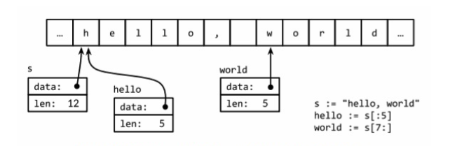

### 基础数据类型

Go 语言将数据类型分为四类：基础类型、复合类型、引用类型和接口类型。

> 整型

Go 语言同时提供了有符号和无符号类型的整数运行。这里有 int8、int16、int32、int64 四种截然不同大小的有符号整数类型、分别对
应 8、16、32、64bit 大小的有符号整数，与此对应的是 uint8、uint16、uint32、uint64 四种无符号整数类型。

这里还有两种一般对应特定 CPU 平台机器字大小的有符号和无符号整数 int 和 uint；其中 int 是应用最广泛的数值类型。这两个类型都有同样
的大小，32 或 64bit，但是我们不能对此做任何假设；因为不同的编译器即使在相同的硬件平台上可能产生不同的大小。

Unicode 字符 rune 类型是和 int32 等价的类型，通常用于表示一个 Unicode 码点。这两个名称可以互换使用。同样 byte 也是 uint8 类型的
等价类型，byte 类型一般用于强调数值是一个原始的数据而不是一个小的整数。

最后，还有一种无符号的整数类型 uintptr，没有指定具体的 bit 大小但是足以容纳指针。uintptr 类型只有在底层编程时才需要，特别是 Go 语
言和 C 语言函数库或操作系统接口相交互的地方。

不管它们的具体大小，int、uint 和 uintptr 是不同类型的兄弟类型。其中 int 和 int32 也是不同的类型，即使 int 的大小也是 32 bit，在
需要将 int 当作 int32 类型的地方需要一个显式的类型转换操作，反之亦然。

其中有符号整数采用 2 的补码形式表示，也就是最高 bit 位用来表示符号位。

一般来说，需要一个的转换将一个值从一种类型转化为另一种类型，并且算术和逻辑运算的二元操作中必须是相同的类型。

在很多场景下，会遇到类似下面的代码能用的错误：

```go
var apples int32 = 1
var oranges int16 = 2
var compote int = apples + oranges // compile error
```

当尝试编译以上代码时，将产生一个错误信息：`invalid operation: apples + oranges (mismatched types int32 and int16)`。
这种类型不匹配的问题可以有几种不同的方法修复，最常见方法是将它们都显式转型为一个常见类型：

```go
var compote = int(apples) + int(oranges)
```

对于每种类型 T，如果转换允许的话，类型转换操作 T(x) 将 x 转换为 T 类型。

> 浮点数

Go 语言提供了两种精度的浮点数，float32 和 float64。

下面程序演示了通过浮点计算生成的图形。

[surface.go](surface.go)

> 复数

Go 语言提供了两种精度的复数类型：complex64 和 complex128，分别对应 float32 和 float64 两种浮点数精度。内置的 complex 函数用于构建
复数，内建的 real 和 imag 函数分别返回复数的实部和虚部。

```go
var x complex128 = complex(1, 2)  // 1 + 2i
var y complex128 = complex(3, 4)  // 3 + 4i
fmt.Println(x * y)  // "(-5+10i)"
fmt.Println(real(x * y)  // "-5"
fmt.Println(imag(x * y)  // "10"
```

在常量算术规则下，一个复数常量可以加到另一个普通数值常量（整数或浮点数、实部或虚部），我们可以用自然的方式书写复数，就像 1 + 2i 或与之
等价的写法 2i + 1。因此，以上 x 和 y 的声明语句还可以简化：

```go
x := 1 + 2i
y := 3 + 4i
```

下面程序使用 complex128 复数算法来生成一个 Mandelbrot 图像。

[mandelbrot.go](mandelbrot.go)

> 布尔型

一个布尔类型的值只有两种：true 和 flase。

> 字符串

一个字符串是一个不可改变的字节序列。字符串可以包含任意的数据，包括 byte 值 0，但是通常是用来包含人类可读的文本。文本字符串通常被解释为
采用 UTF-8 编码的 Unicode 码点(rune)序列。

内置的 len 函数可以返回一个字符串中的字节数目（不是 rune 字符数目）索引操作 s[i] 返回第 i 个字节的字节值，i 必须满足`0 ≤ i ≤ len(s)`
条件约束。

```go
s := "hello, world"
fmt.Println(len(s))  // "12"
fmt.Println(s[0], s[7])  // "104 119" ('h' and 'w')
```

如果试图访问超出字符串索引范围的字节将会导致 panic 异常：`c := s[len(s)]  // panic: index out of range`。

第 i 个字节并不一定是字符串的第 i 个字符，因为对于非 ASCII 字符的 UTF8 编码会要两个或多个字节。先简单说说字符的工作方式。

子字符串操作 s[i:j] 基于原始的 s 字符串的第 i 个字节开始到第 j 个字节（并不包含 j 本身）生成一个新字符串。生成的新字符串将包含 j-i 个
字节。

```go
fmt.Println(s[0:5])  // "hello"
```

不管 i 还是 j 都可能被忽略，当它们被忽略时将采用 0 作为开始位置，采用 len(s) 作为结束的位置。

```go
fmt.Println(s[:5])  // "hello"
fmt.Println(s[7:])  // "world"
fmt.Println(s[:])  // "hello, world"
```

其中`+`操作符将两个字符串链接构造一个新字符串：

```go
fmt.Println("goodbye" + s[5:])  // "goodbye, world"
```

字符串可以用`==`和`<`进行比较；比较通过逐个字节比较完成的，因此比较的结果是字符串自然编码的顺序。字符串的值是不可变的：一个字符串包含的
字节序列永远不会被改变，当然我们也可以给一个字符串变量分配一个新字符串值。可以像下面这样将一个字符串追回到另一个字符串：

```go
s := "left foot"
t := s
s += ", right foot"
```

这并不会导致原始的字符串值被改变，但是变量 s 将因为 += 语句持有一个新的字符串值，但是 t 依然是包含原先的字符串值。因为字符串是不可修改
的，因为尝试修改字符串内部数据的操作也是被禁止的：`s[0] = 'L'  // compile error: cannot assign to s[0]`。

不变性意味如果两个字符串共享相同的底层数据的话也是安全的，这使得复制任何长度的字符串代价是低廉的。同样，一个字符串 s 和对应的子字符串切
片 s[7:] 的操作也可以安全地共享相同的内存，因此字符串切片操作代价也是低廉的。在这两种情况下都没有必要分配新的内存。下图演示了一个字符串
和两个子串共享相同的底层数据。



>> 字符串面值

字符串面值也可以用字符串面值方式编写，只要将一系列字节序列包含在双引号即可：`Hello, 世界`。因为 Go 语言源文件总是用 UTF8 编码，并且 Go 
语言的文本字符串也以 UTF8 编码的方式处理，因此我们可以将 Unicode 码点也写到字符串面值中。在一个双引号包含的字符串面值中，可以用以反斜
杠`\`开头的转义序列插入任意的数据。

一个原生的字符串面值形式是 **\`...\`**，使用反引号代替双引号。在原生的字符串面值中，没有转义操作；全部的内容都是字面的意思，包含退格和
换行，因此一个程序中的原生字符串面值可能跨越多行（注：在原生字符串面值内部是无法直接写 **\`** 字符的，可以用八进制或十六进制转义或加链
接字符串常量完成）。
