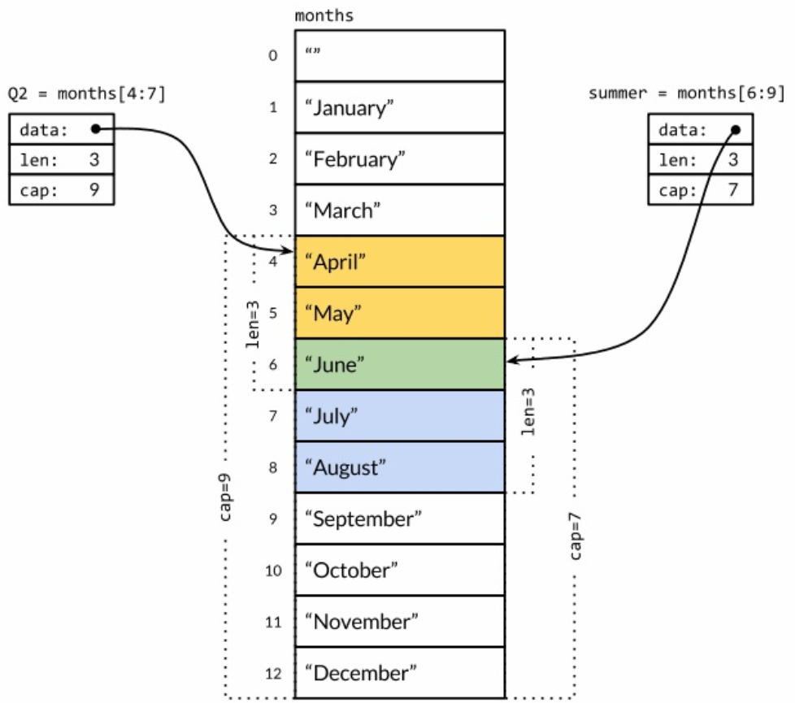
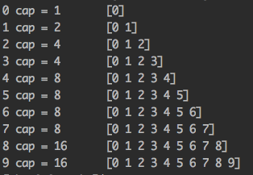
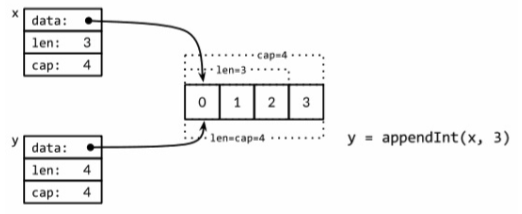
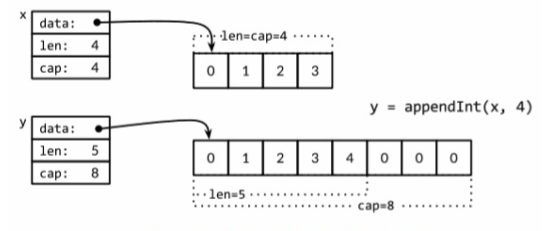

### 复合数据类型

基本数据类型可以用于构建程序中的数据结构，是 Go 语言世界的原子。这里主要讨论四种类型——数组、slice、map 和结构体。
数组和结构体是聚合类型；它闪的值由许多元素或成员字段的值组成。数组是由同构的元素组成——每个数组元素都是完全相同的类
型，结构体则是由异构的元素组成。数组和结构体都是有固定内存大小的数据结构。相比之下，slice 和 map 则是动态的数据结
构，它们将根据需要动态增长。

> 数组

数组是一个由固定长度的特定类型元素组成的序列，一个数组可以由零个或多个元素组成。和数组对应的类型是 Slice(切片)，它
是可以增长和收缩的动态序列，slice 功能也更灵活，但是要理解 slice 工作原理的话需要先理解数组。

默认情况下，数组的每个元素都被初始化为元素类型对应的零值。也可以使用数组字面值语法用一组值来初始化数组：

```go
var q [3]int = [3]int{1, 2, 3}
var r [3]int = [3]int{1, 2}
fmt.Println(r[2])  // "0"
```

在数组字面值中，如果在数组的长度位置出现的是 **...** 省略号，则表示数组的长度是根据初始化值的个数来计算。

```go
q := [...]int{1, 2, 3}
fmt.Println("%T\n", q)  // "[3]int"
```

数组的长度是数组类型的一个组成部分，因此`[3]int`和`[4]int`是两种不同的数组类型。数组的长度必须是常量表达式，因为数
组的长度需要在编译阶段确定。

```go
q := [3]int{1, 2, 3}
q = [4]int{1, 2, 3, 4}  // compile error: cannot assign [4]int to [3]int
```

以上的形式是直接提供顺序初始化值序列，但是也可以指定一个索引和对应值列表的方式初始化，如下：

```go
type Currency int

const (
	USD Currency = iota  // 美元
	EUR                  // 欧元
	GBP                  // 英镑
	RMB                  // 人民币
)

symbol := [...]string{USD: "$", EUR: "€", GBP: "￡", RMB: "￥"}

fmt.Println(RMB, symbol[RMB])  // "3 ￥"
```

在这种形式的数组字面值形式中，初始化索引的顺序是无关紧要的，而且没用到的索引可以省略，未指定初始值的元素将用零值初始化。
如，

```go
r := [...]int{99: -1}
```

定义了一个含有 100 个元素的数组 r，最后一个元素被初始化为 -1，其它元素都是用 0 初始化。

如果一个数组的元素类型是可以相互比较的，那么数组类型也是可以相互比较的，这时候可以直接通过`==`比较运算符来比较。只有
两个数组的所有元素都是相等的时候数组才是相等的。

```go
a := [2]int{1, 2}
b := [...]int{1, 2}
c := [2]int{1, 3}
fmt.Println(a == b, a == c, b == c)  // "true false false"
d := [3]int{1, 2}
fmt.Println(a == d)  // compile error: cannot compare [2]int == [3]int
```

`crypto/sha256`包的 Sum256 函数对一个任意字节的 slice 类型的数据生成一个对应的消息摘要。消息摘要有 256bit 大小，
因此对应 [32]byte 数组类型。如果两个消息摘要是相同的，那么可以认为两个消息本身也相同（理论上有 HASH 码碰撞的情况，
但实际上可以基本忽略）。

[sha256](sha256.go)

> Slice

Slice(切片)代表变长的序列，序列中每个元素都有相同的类型。一个 slice 类型一般写作`[]T`，其中 T 代表 slice 中元素
的类型；slice 的语法和数组很像，只是没有固定长度而已。

数组和 slice 之间有着紧密的联系。一个 slice 是一个轻量级的数据结构，提供了访问数组子序列（或者全部）元素的功能，而
且 slice 的底层确实引用一个数组对象。一个 slice 由三个部分构成：指针、长度和容量。指针指向第一个 slice 元素对应的
底层数组元素的地址，要注意的是 slice 的第一个元素并不一定就是数组的第一个元素。长度对应 slice 中元素的数目；长度不
能超过容量，容量一般是从 slice 的开始位置到底层数据的结尾位置。内置的 len 和 cap 函数分别返回 slice 的长度和容量。

多个 slice 之间可以共享底层的数据，并且引用的数组部分区间可能重叠。

数组这样定义：

```go
months := [...]string{1: "January", /* ... */, 12: "December"}
```

slice 的切片操作`s[i:j]`，其中`0<=i<=j<=cap(s)`，用于创建一个新的 slice，引用 s 的从第 i 个元素开始到第 j-1 
个元素的子序列。新的 slice 将只有 j-i 个元素。如果 i 位置的索引被省略的话将使用 0 代替，如果 j 位置的索引被省略的
话将使用 len(s) 代替。因此，months[1:13]切片操作将引用全部有效的月份，和 months[1:]操作等价；months[:]切片操
作则是引用整个数组。分别定义表示第二季度和北方夏天月份的 slice，它们有重叠部分：



```go
Q2 := months[4:7]
summer := months[6:9]
fmt.Println(Q2)      // ["April" "May" "June"]
fmt.Println(summer)  // ["June" "July" "August"]
```

如果切片操作超出 cap(s) 的上限将导致一个 panic 异常，但是超出 len(s) 则意味着扩展了 slice，因为新 slice 的长
度会变大：

```go
fmt.Println(summer[:20])  // panic: out of range

endlessSummer := summer[:5]  // extend a slice (within capacity)
fmt.Println(endlessSummer)   // "[June July August September October]"
fmt.Println(summer)          // "[June July August]"
```

另外，字符串的切片操作和 []byte 字节类型的切片操作是类似的。都写作 x[m:n]，并且都是返回一个原始字节系列的子序列，
底层都是共享之前的底层数组，因此这种操作都是常量时间复杂度。

因为 slice 值包含指向第一个 slice 元素的指针，因此向函数传递 slice 将允许在函数内部修改底层数组的元素。换句话说，
复制一个 slice 只是对底层的数组创建了一个新的 slice 别名。

[rev.go](rev.go)

注意，rev.go 文件中的 slice 类型的变量 s 和数组类型的变量 a 的初始化语法的差异。slice 和数组的字面值语法很类似，
但是对于 slice 并没有指明序列的长度。这会隐式地创建一个合适大小的数组，然后 slice 的指针指向底层的数组。就像数组
字面值一样，slice 的字面值也可以按顺序指定初始化值序列，或者是通过索引和元素值指定，或者两种风格的混合语法初始化。

和数组不同的是，slice 之间不能比较，因此不能使用`==`操作符来判断两个 slice 是否含有全部相等元素。

如果要测试一个 slice 是否是空的，使用`len(s) == 0`来判断，而不应该用`s == nil`来判断。除了和 nil 相等比较外，
一个 nil 值的 slice 行为和其它任意 0 长度的 slice 一样。

内置的 make 函数创建一个指定元素类型、长度和容量的 slice。容量部分可以忽略，这种情况下，容量将等于长度。

```go
make([]T, len)
make([]T, len, cap)  // same as make([]T, cap)[:len]
```

在底层，make 创建了一个匿名的数组变量，然后返回一个 slice；只有通过返回的 slice 才能引用底层匿名的数组变量。在第一种语句中，slice 是
整个数组的 view。在第二种语句中，slice 只引用了底层数组的前 len 个元素，但是容量将包含整个数组。额外的元素是留给未来的增长用的。

>> append 函数

内置的 append 函数用于向 slice 追加元素：

```go
var runes []rune
for _, r := range "Hello, 世界" {
    runes = append(runes, r)
}
fmt.Printf("%q\n", runes)  // "['H' 'e' 'l' 'l' 'o' ',' ' ' '世' '界']"
```

append 函数对于理解 slice 底层是如何工作的非常重要。

[append.go](append.go)

每次调用 appendInt 函数，先检测 slice 底层数组是否有足够的容量来保存新添加的元素。如果有足够的空间，直接扩展 slice（依然在原有的底层
数组之上），将新添加的 y 元素复制到新扩展的空间，并返回 slice。因此，输入的 x 和输出的 z 共享相同的底层数组。

如果没有足够的增长空间，appendInt 函数则会先分配一个足够大的 slice 用于保存新的结果，先将输入的 x 复制到新的空间，然后添加 y 元素。结
果 z 和输入的 x 引用的将是不同的底层数组。

为了提高内存使用效率，新分配的数组一般略大于保存 x 和 y 所需要的最低大小。通过在每次扩展数组时直接将长度翻倍从而避免了多次内存分配，也
确保了添加单个元素的平均时间是一个常数时间。

append.go 程序执行结果如下图：



当 i ＝ 3 时，x 包含了`[0 1 2]`三个元素，但是容量是 4，因此可以简单地将新的元素添加到末尾，不需要新的内存分配。然后新的 y 的长度和容量
都是 4，并且和 x 引用着相同的底层数组。如图：



在下一次迭代时 i = 4，现在没有新的空余的空间了，因此 appendInt 函数分配一个容量为 8 的底层数组，将 x 的 4 个元素`[0 1 2 3]`复制到新
空间的开头，然后添加新的元素 i，新的 y 的长度是 5，容量是 8；后面有 3 个空闲的位置，三次迭代都不需要分配新的空间。当前迭代中，y 和 x 是
对应不同底层数组的 view。这次操作如图：



内置的 append 函数可能使用比 appendInt 更复杂的内存扩展策略。因此，通常我们并不知道 append 调用是否导致了内存的重新分配，因此我们也不
能确认新的 slice 和原始的 slice 是否引用的是相同的底层数组空间。同样，我们不能确认在原先的 slice 上的操作是否会影响到新的 slice。因
此，通常是将 append 返回的结果直接赋值给输入的 slice 变量：

```go
runes = append(runes, r)
```

更新 slice 变量不仅对调用 append 函数是必要的，实际上对应任何可能导致长度、容量或底层数组变化的操作都是必要的。**要正确地使用 slice，
需要记住尽管底层数组的元素是间接访问的，但是 slice 对应结构体本身的指针、长度和容量部分是直接访问的。** 要更新这些信息需要像上面例子那
样一个显式的赋值操作。从这个角度看，slice 并不是一个纯粹的引用类型，它实际上是一个类似下面结构体的聚合类型：

```go
type IntSlice struct {
    ptr *int
    len, cap int
}
```

上面封装的 appendInt 函数每次只能向 slice 追加一个元素，但是内置的 append 函数则可以追加多个元素，甚至追加一个 slice。

```go
var x []int
x = append(x, 1)
x = append(x, 2, 3)
x = append(x, 4, 5, 6)
x = append(x, x...)  // append the slice x
fmt.Println(x)  // "[1 2 3 4 5 6 1 2 3 4 5 6]"
```

通过下面的小修改，可以达到 append 函数类似的功能。其中在 appendInt 函数参数中最后`...`省略号表示接收变长的参数为 slice。

```go
func appendInt(x []int, y ...int) []int {
    var z []int
    zlen := len(x) + len(y)
    // ...expand z to at least zlen...
    copy(z[len(x):], y)
    return z
}
```

>> Slice 内存技巧

下面的 nonempty 函数将在原有 slice 内存空间之上返回不包含空字符串的列表：

[nonempty.go](nonempty.go)

这里比较微妙的地方是，输入的 slice 和输出的 slice 共享一个底层数组。这可以避免分配另一个数组，不过原来的数据将可能被覆盖。因此通常这样
使用 nonempty 函数：`strings = nonempty(strings)`。

nonempty 函数也可以用 append 函数来实现：

[nonempty2.go](nonempty2.go)

一个 slice 可以用来模拟一个 stack。

```go
stack = append(stack, v)  // push v
```

stack 的顶部位置对应 slice 的最后一个元素：

```go
top := stack[len(stack) - 1]  // top of stack
```

通过收缩 stack 可以弹出栈顶的元素

```go
stack = stack[:len(stack) - 1]  // pop
```

要删除 slice 中间的某个元素并保存原有的元素顺序，可以通过内置的 copy 函数将后面的子 slice 向前依次移动一位完成：

```go
func remove(slice []int, i int) []int {
    copy(slice[i:], slice[i+1:])
    return slice[:len(slice) - 1]
}

func main() {
    s := []int{5, 6, 7, 8, 9}
    fmt.Println(remove(s, 2))  // "[5 6 8 9]"
}
```

如果删除元素后不用保持原来顺序的话，可以简单地用最后一个元素覆盖被删除的元素：

```go
func remove(slice []int, i int) []int {
    slice[i] = slice[len(slice)-1]
    return slice[:len(slice)-1]
}

func main() {
    s := []int{5, 6, 7, 8, 9}
    fmt.Println(remove(s, 2))  // "[5 6 9 8]"
}
```

> Map

哈希表是一种巧妙并且实用的数据结构。它是一个无序的 key/value 对的集合，其中所有的 key 都是不同的，然后通过给定的 key 可以在常数时间复
杂度内检索、更新或删除对应的 value。

在 Go 语言中，一个 map 就是一个哈希表的引用，map 类型可以写为`map[K]V`，其中 K 和 V 分别对应 key 和 value。map 中所有的 key 都有相
同的类型，所有的 value 也有着相同的类型，但是 key 和 value 之间可以是不同的数据类型。其中 K 对应的 key 必须是支持`==`比较运算符的数据
类型，所以 map 可以通过测试 key 是否相等来判断是否已经存在。**虽然浮点数类型也是支持相等运算符比较的，但是将浮点数用做 key 类型则是一个
坏的想法**。

内置的 make 函数可以创建一个 map：

```go
ages := make(map[string]int)  // mapping from string to ints
```

也可以用 map 字面值的语法创建 map，同时还可以指定一些最初的 key/value：

```go
ages := map[string]int{
    "alice": 31,
    "charlie": 34,
}
```

这相当于：

```go
ages := make(map[string]int)
ages["alice"] = 31
ages["charlie"] = 34
```

因此，另一种创建空 map 的表达式是`map[string]int{}`。

map 中的元素通过 key 对应的下标语法访问：`ages["alice"] = 32`、`fmt.Println(ages["alice"])  // "32"`。

使用内置的 delete 函数可以删除元素：`delete(ages, "alice")  // remove element ages["alice"]`。所有这些操作都是安全的，即使这些
元素不在 map。如果一个查找失败将返回 value 类型对应的零值。

**但是，map 中的元素并不是一个变量，因此不能对其进行取址操作。禁止对 map 元素取址的原因是 map 可能随着元素数量的增长而重新分配更大的内
存空间，从而可能导致之前的地址无效。**

要想遍历 map 中全部的 key/value 对的话，可以使用 range 风格的 for 循环实现。map 迭代的顺序是不确定的，并且不同的哈希函数实现可能导致
不同的遍历顺序。在实践中，遍历的顺序是随机的。**这是故意的，每次都使用随机的遍历顺序可以强制要求程序不会依赖具体的哈希函数实现。如果要按
顺序遍历，可以先排序。

map 类型的零值是 nil，也就是没有引用任何哈希表。map 上的大部分操作，包括查找、删除、len 和 range 循环都可以安全工作在 nil 值的 map 上，
它们的行为和一个空的 map 类似。但是向一个 nil 值的 map 存入元素将导致一个 panic 异常。

Go 语言中并没有提供一个 set 类型，但是 map 中的 key 也是不相同的，可以用 map 实现类似 set 的功能。以下 dedup 程序读取多行输入，但是
只打印第一次出现的行。dedup 程序通过 map 来表示所有的输入行所对应的 set 集合，以确保已经在集合存在的行不会被重复打印。

[dedup.go](dedup.go)

下面程序用于统计输入中每个 Unicode 码点出现的次数。

[charcount.go](charcount.go)

map 的 value 类型也可以是一个聚合类型，比如是一个 map 或 slice。

[graph.go](graph.go)

> 结构体

结构体是一种聚合的数据类型，是由零个或多个任意类型的值聚合成的实体。每个值称为结构体的成员。

下面代码声明了一个叫 Employee 的结构体类型，并且声明了一个 Employee 类型的变量 dilbert。

```go
type Employee struct {
    ID          int
    Name        string
    Address     string
    DoB         time.Time
    Position    string
    Salary      int
    ManagerID   int 
}

var dilbert Employee
```

dilbert 结构体变量的成员可以通过点操作符访问，比如 dilbert.Name 和 dilbert.DoB。因为 dilbert 是一个变量，它所有的成员也同样是变量，
可以直接对每个成员赋值：

```go
dilbert.Salary -= 5000  // demoted, for writingn too few lines of code
```

或者对成员取址，然后通过指针访问：

```go
position := &dilbert.Position
*position = "Senior " + *position  // promoted, for outsourcing to Elbonia
```

点操作符也可以和指向结构体的指针一起工作：

```go
var employeeOfTheMonth *Employee = &dilbert
employeeOfTheMonth.Position += " (proactive team player)"
```

相当于下面语句：

```go
(*employeeOfTheMonth).Position += " (proactive team player)"
```