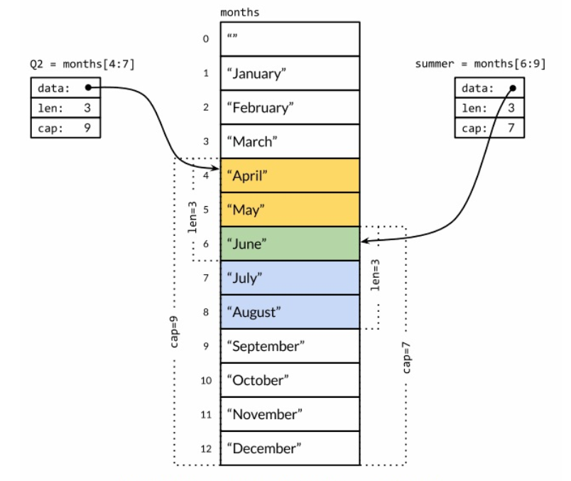

# 复合数据类型

复合数据类型，它是以不同的方式组合基本类型可以构造出来的复合数据类型。数组和结构体是聚合类型；它们的
值由许多元素或成员字段的值组成。数组是由同构的元素组成——每个数组元素都是完全相同的类型——结构体则是
由异构的元素组成的。数组和结构体都是有固定内存大小的数据结构。相比之下，slice 和 map 则是动态的
数据结构，它们将根据需要动态增长。

### 数组

数组是一个由固定长度的特定类型元素组成的序列，一个数组可以由零个或多个元素组成。因为数组的长度是
固定的，因此在 Go 语言中很少直接使用数组。和数组对应的类型是 Slice（切片），它是可以增长和收缩
的动态序列，slice 功能也更灵活，但是要理解 slice 工作原理的话需要先理解数组。

默认情况下，数组的每个元素都被初始化为元素类型对应的零值，对于数字类型来说就是 0。也可以使用数组
字面值语法用一组值来初始化数组：

```
var q [3]int = [3]int{1, 2, 3}
var r [3]int = [3]int{1, 2}
fmt.Println(r[2])  // "0"
```

在数组字面值中，如果在数组的长度位置出现的是“...”省略号，则表示数组的长度是根据初始化值的个数来
计算。因此，上面 q 数组的定义可以简化为：

```go
q := [...]int{1, 2, 3}
fmt.Printf("%T\n", q)  // "[3]int"
```

数组的长度是数组类型的一个组成部分，因此 [3]int 和 [4]int 是两种不同的数组类型。数组的长度必须
是常量表达式，因为数组的长度需要在编译阶段确定。

```
q := [3]int{1, 2, 3}
q = [4]int{1, 2, 3, 4}  // compile error: cannot assign [4]int to [3]int
```

以上的形式是直接提供顺序初始化值序列，但是也可以指定一个索引和对应值列表的方式初始化，如下：

```go
type Currency int

const (
	USD Currenty = iota     // 美元
	EUR                     // 欧元
	GBP                     // 英镑
	RMB                     // 人民币
)

symbol := [...]string{USD: "$", EUR: "€", GBP: "£", RMB: "¥"}

fmt.Println(RMB, symbol[RMB])
```

如果一个数组的元素类型是可以相互比较的，那么数组类型也是可以相互比较的。只有当两个数组的所有
元素都是相等的时候数组才是相等的。

```
a := [2]int{1, 2}
b := [...]int{1, 2}
c := [2]int{1, 3}
fmt.Println(a == b, a == c, b == c) // true, false, false
d := [3]int{1, 2}
fmt.Println(a == d) // compile error: cannot compare [2]int == [3]int
```

### Slice

Slice（切片）代表变长的序列，序列中每个元素都有相同的类型。slice 的语法和数组很像，只是没有
固定长度而已。

数组和 slice 之间有着紧密的联系。一个 slice 是一个轻量级的数据类型，提供了访问数组子序列（
或者全部）元素的功能，而且 slice 的底层确实引用一个数组对象。一个 slice 由三个部分构成：
指针，长度和容量。指针指向第一个 slice 元素对应的底层数组元素的地址，要注意的是 slice 的第
一个元素并不一定就是数组的第一个元素。长度对应 slice 中元素的数目；长度不能超过容量，容量
一般是从 slice 的开始位置到底层数组的结尾位置。

多个 slice 之间可以共享底层的数据，并且引用的数组部分区间可能重叠。

```
months := [...]string{1: "January", 2: "February", 3: "March", 4: "April", 
                    5: "May", 6: "June", 7: "July", 8: "August", 9: "September",
                    10: "October", 11: "November", 12: "December"}
```

以上数组第 0 个元素为空字符串。下面定义表示第二季度和北方夏天月份的 slice，它们有重叠部分：

```go
Q2 := months[4:7]
summer := months[6:9]
fmt.Println(Q2)     // ["April" "May" "June"]
fmt.Println(summer) // ["June" "July" "August"]
```

两个 slice 之间的关系如下图：



如果切片操作超出 cap(s) 的上限将导致一个 panic 异常，但是超出 len(s) 则是意味着扩展了
slice，因为新 slice 的长度会变大：

```go
fmt.Println(summer[:20])    // panic: out of range

endlessSummer := summer[:5] // extend a slice (within capacity)
fmt.Println(endlessSummer)  // "[June July August September October]"
```

字符串的切片操作和 []byte 字节类型切片的切片操作是类似的。都写作 x[m:n]，并且都是返回一个
原始字节系列的子系列，底层都是共享之前的底层数组，因此这种操作都是常量时间复杂度。x[m:n]
切片操作对于字符串则生成一个新字符串，如果 x 是 []byte 的话则生成一个新的 []byte。

和数组不同的是，slice 之间不能比较，因此不能使用 == 操作符来判断两个 slice 是否含有全部相等元素。
不过标准库提供了高度优化的 bytes.Equal 函数来判断两个字节型 slice 是否相等（[]byte），但是对于
其他类型的 slice，必须自己展开每个元素进行比较：

```go
func equal(x, y []string) bool {
	if len(x) != len(y) {
		return false
	}
	
	for i := range x {
		if x[i] != y[i] {
			return false
		}
	}
	return true
}
```

由于一个 slice 的元素是间接引用的，甚至可以包含自身。虽然有很多办法处理这种情形，但是没有一个是简
单有效的。另外，一个固定的 slice 值（指 slice 本身的值，不是元素的值）在不同的时刻可能包含不同的
元素，因为底层数组的元素可能会被修改。

slice 唯一合法的比较操作是和 nil 比较。一个零值的 slice 等于 nil。一个 nil 值的 slice 并没有
底层数组。一个 nil 值的 slice 的长度和容量都是 0，但是也有非 nil 值的 slice 的长度和容量也是 0
的，例如 []int{} 或 make([]int, 3)[3:]。与任意类型的 nil 值一样，可以用 []int(nil) 类型转
换表达式来生成一个对应类型 slice 的 nil 值。

```go
var s []int     // len(s) == 0, s == nil
s = nil         // len(s) == 0, s == nil
s = []int(nil)  // len(s) == 0, s == nil
s = []int{}     // len(s) == 0, s != nil
```

如果需要测试一个 slice 是否是空的，使用 len(s) == 0 来判断，而不应该用 s == nil 来判断。除了和
nil 相等比较外，一个 nil 值的 slice 的行为和其它任意 0 长度的 slice 一样，例如 reverse(nil) 
也是安全的。除了文档已经明确说明的地方，所有的 Go 语言函数应该以相同的方式对待 nil 值的 slice 和
0 长度的 slice。

slice 并不是一个纯粹的引用类型，它实际上是一个类似下面结构体的聚合类型：

```go
type IntSlice struct {
	ptr         *int
	len, cap    int
}
```

### Map

哈希表是一种巧妙并且实用的数据结构。它是一个无序的 key/value 对的集合，其中所有的 key 都是不同的，
然后通过给定的 key 可以在常数时间复杂度内检索、更新或删除对应的 value。

在 Go 语言中，一个 map 就是一个哈希表的引用，map 类型可以写为 map[K]V，其中 K 和 V 分别对应 key
和 value。K 对应的 key 必须是支持 == 比较运算符的数据类型，所以 map 可以通过测试 key 是否相等来
判断是否已经存在。`虽然浮点数类型也是支持相等运算符比较的，但是将浮点数用做 key 类型则是一个坏的想法，
最坏的情况是可能出现的 NaN 和任何浮点数都不相等。对于 V 对应的 value 数据类型则是没有任何限制。

map 类型的零值是 nil，也就是没有引用任何哈希表。

```go
var ages map[string]int
fmt.Println(ages == nil)    // "true"
fmt.Println(len(ages) == 0) // "true"
```

map 上的大部分操作，包括查找，删除，len 和 range 循环都可以安全工作在 nil 值的 map 上，它们的行
为和一个空的 map 类似。但是向一个 nil 值的 map 存入元素将导致一个 panic 异常：

```go
ages["carol"] = 21  // panic: assignment to entry in nil map
```

在向 map 存数据前必须先创建 map。创建 map 的方式有以下几种：

```go
// make 创建 map
ages := make(map[string]int)

// map 字面值语法创建 map
ages := map[string]int{}

// 还可以在创建时指定一些最初的 key/value
ages := map[string]int{
	"alice":    31,
	"charlie":  34,
}
```

通过 key 作为索引下标来访问 map 将产生一个 value。如果 key 在 map 中是存在的，那么将得到与 key
对应的 value；如果 key 不存在，那么将得到 value 对应类型的零值。然而，如果存在一个 value 为零
值的 key/value 对时，无法判断该元素已存在。这时候可以如下测试：

```go
age, ok := ages["bob"]
if !ok {
	/* "bob" is not a key in this map; age == 0 */
}
```

和 slice 一样，map 之间也不能进行相等比较；唯一的例外是和 nil 进行比较。

Go 语言中并没有提供一个 set 类型，但是 map 中的 key 也是不相同的，可以用 map 实现类似 set 的
功能，如[dedup.go](./cmd/dedup.go)。

### 结构体

结构体是一种聚合的数据类型，是由零个或多个任意类型的值聚合成的实体。每个值称为结构体的成员。以下代码
声明了一个叫 Employee 的结构体类型，并且声明了一个 Employee 类型的变量 dilbert：

```go
type Employee struct {
	ID          int
	Name        string
	Address     string
	DoB         time.Time
	Position    string
	Salary      int
	ManagerID   int
}

var dilbert Employee
```

dilbert 结构体变量的成员可以通过点操作符访问。因为 dilbert 是一个变量，它所有的成员也同样是变量，
可以直接对每个成员赋值：

```go
dilbert.Salary -= 5000  // demoted, for writing too few lines of code
```

或者是对成员取地址，然后通过指针访问：

```go
position := &dilbert.Position
*position = "Senior " + *position   // promoted, for outsourcing to Elbonia
```

点操作符也可以和指向结构体的指针一起工作：

```go
var employeeOfTheMonth *Employee = &dilbert
employeeOfTheMonth.Position += " (proactive team player)"
```

相当于以下语句：

```go
(*employeeOfTheMonth).Positioin += " (proactive team player)"
```

下面的 EmployeeByID 函数将根据给定的员工 ID 返回对应的员工信息结构体的指针。可以使用点操作符来访问它里面的成员：

```go
func EmployeeByID(id int) *Employee { /* ... */ }
fmt.Println(EmployeeByID(dilbert.ManagerID).Position)   // "Pointy-haired boss"

id := dilbert.ID
EmployeeByID(id).Salary = 0 // fired for ... no real reason
```

`EmployeeByID(id).Salary = 0`通过 EmployeeByID 返回的结构体指针更新了 Employee 结构体的成员。如果将
EmployeeByID 函数的返回值从 `*Employee`指针类型改为 Employee 值类型，那么更新语句将不能编译通过，因为在赋值
语句的左边并不确定是一个变量，也就是说调用函数返回的是值，并不是一个可取地址的变量，具体可见[Employee.go](./cmd/Employee.go)。

一个命名为 S 的结构体类型将不能再包含 S 类型的成员：因为一个聚合的值不能包含它自身。该限制同样适用于数组。但是 S 类型的结构体可以包含
`*S`指针类型的成员，这可以让我们创建递归的数据结构，比如链表和树结构等。

结构体类型的零值是每个成员都是零值。如果结构体没有任何成员的话就是空结构体，写作 struct{}。它的大小为 0，也不包含任何信息，但是有时候
依然是有价值的。

#### 结构体字面值

结构体值也可以用结构体字面值表示，结构体字面值可以指定每个成员的值。

```go
type Point struct{ X, Y int }
p := Point{1, 2}
```

以上是第一种写法，要求以结构体成员定义的顺序为每个结构体成员指定一个字面值。它要求写代码和读代码的人要记住结构体的每个成员的类型和顺序。
更常用的是第二种写法，如下：

```go
pt := Point{Y: 2}
```

这种写法中，如果成员被忽略的话将默认用零值。因为提供了成员的名字，所以成员出现的顺序并不重要。

#### 结构体比较

如果结构体的全部成员都是可以比较的，那么结构体也是可以比较的。

#### 结构体嵌入和匿名成员

Go 语言有一个特性让我们只声明一个成员对应的数据类型而不指名成员的名字；这类成员就叫匿名成员。匿名成员的数据类型必须是命名
的类型或指向一个命名的类型的指针。

```go
type Point struct {
	X, Y int
}

type Circle struct {
	Point
	Radius int
}

type Wheel struct {
	Circle
	Spokes int
}

var w Wheel
w.X = 8
x.Y = 8
w.Radius = 5
w.Spokes = 20
```

**不过，结构体字面值并没有简短表示匿名成员的语法，因此下面的语句都不能编译通过**：

```go
w = Wheel{8, 8, 5, 20}
w = Wheel{X: 8, Y: 8, Radius: 5, Spokes: 20}
```

结构体字面值必须遵循形状类型声明时的结构，所以只能用下面的两种语法，它们彼此是等价的：

```go
w = Wheel{Circle{Point{8, 8}, 5}, 20}

w = Wheel{
    Circle: Circle{
        Point: Point{X: 8, Y: 8},
        Radius: 5,
    },
    Spokes: 20,
}

fmt.Printf("%#v\n", w)

w.X = 42
fmt.Printf("%#v\n", w)
```

完整代码[embed.go](./cmd/embed.go)。


因为匿成员也有一隐式的名字，因此不能同时包含两个类型相同的匿名成员，这会导致名字冲突。同时，因为成员的名字是由其类型隐式地决定的，
所有匿名成员也有可见性的规则约束。上例中，Point 和 Circle 匿名成员都是导出的。

匿名成员并不要求是结构体类型；其实任何命名的类型都可以作为结构体的匿名成员。但是为什么要嵌入一个没有任何子成员类型的匿名成员类型呢？

答案是匿名类型的方法集。简短的点运算语法可以用于选择匿名成员嵌套的成员，也可以用于访问它们的方法。实际上，外层的结构体不仅仅是获得
了匿名成员类型的所有成员，而且也获得了该类型导出的全部的方法。这个机制可以用于将一个有简单行为的对象组合成有复杂行为的对象。

**组合是 Go 语言中面向对象编程的核心。**

### JSON

JavaScript 对象表示法(JSON)是一种用于改送和接收结构化信息的标准协议。在类似的协议中，JSON 并不是唯一的一个标准协议。XML、ASN.1 和
Google 的 Protocol Buffers 都是类似的协议，并且有各自的特色，但是由于简洁性、可读性和流行程序等原因，JSON 是应用最广泛的一个。

在编码时，默认使用 Go 语言结构体的成员名字作为 JSON 的对象。只有导出的结构体成员才会被编码，这也是我们为什么选择用大写字母开着的成员名称。
如[movie.go](./cmd/movie.go)，在该代码中，Year 名字的成员在编码后变成了 released，还有 Color 成员编码后变成了小写字母开头的 color。
这是因为构体成员 Tag 所导致的。一个构体成员 Tag 是在编译阶段关联到该成员的元信息字符串。

```go
Year    int     `json:"release"`
Color   bool    `json:"color,omitempty"`
```

结构体的成员 Tag 可以是任意的字符串面值，但是通常是一系列用空格分隔的`key:"value"`键值对序列；因为值中含有双引号字符，因此成员 Tag 一般
用原生字符串面值的形式书写。json 开头键名对应的值用于控制 encoding/json 包的编码和解码行为，并且 encoding/... 下面其它的包也遵循这个
约定。成员 Tag 中 json 对应值的第一部分用于指定 JSON 对象的名字，比如将 Go 语言中的 TotalCount 成员对应到 JSON 中的 total_count 对象。
Color 成员的 Tag 还带了一个额外的 omitempty 选项，表示当 Go 语言结构体成员为空或零值时不生成 JSON 对象（这里 false 为零值）。
