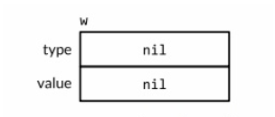
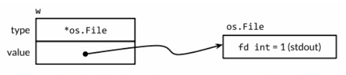
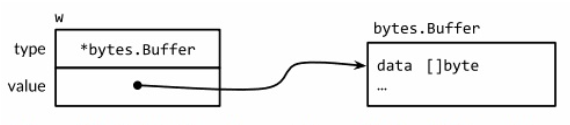

# 接口

接口类型是对其它类型行为的抽象和概括；因为接口类型不会和特定的实现细节绑定在一起，通过这种抽象的方式我
们可以让函数更加灵活和更具有适应能力。

很多面向对象的语言都有相似的接口概念，但 Go 语言中接口类型的独特之处在于它是满足隐式实现的。也就是说，
我们没有必要对于给定的具体类型定义所有满足的接口类型；简单拥有一些必需的方法就足够了。这种设计可以让你
创建一个新的接口类型满足已经存在的具体类型却不会去改变这些类型的定义。

### 接口约定

接口类型是一种抽象的类型。它不会暴露出它所代表的对象的内部值的结构和这个对象支持的基础操作的集合；
它只会展示出自己的方法。你不知道它是什么，唯一知道的就是可以通过它的方法来做什么。

得益于使用接口，fmt.Printf 和 fmt.Sprintf 都使用了另一个函数 fmt.Fprintf 来进行封装。
fmt.Fprintf 这个函数对它的计算结果会被怎么使用是完全不知道的。

```go
package fmt

func Fprintf(w io.Writer, format string, args ...interface{}) (int, error)
func Printf(format string, args ...interface{}) (int, error) {
	return Fprintf(os.Stdout, format, args...)
}
func Sprintf(format string, args ...interface{}) string {
	var buf bytes.Buffer
	Fprintf(&buf, format, args...)
	return buf.String()
}
```

即使 Fprintf 函数中的第一个参数也不是文件类型。它是 io.Writer 类型，这是一个接口类型。

```go
package io

// Writer is the interface that wraps the basic Write method.
type Writer interface {
	// Write writes len(p) bytes from p to the underlying data stream.
	// It returns the number of bytes written from p (p <= n <= len(p))
	// and any error encountered that caused the write to stop early.
	// Write must return a non-nil error if it returns n < len(p).
	// Write must not modify the slice data, even temporarily.
	// 
	// Implementations must not retain p.
	Write(p []byte) (n int, err error)
}
```

io.Writer 类型定义了函数 Fprintf 和这个函数调用者之间的约定。一方面这个约定需要调用者提供具体类型
的值就像`*os.File`和`*bytes.Buffer`，这些类型都有一个特定签名和行为的 Write 的函数。另一方面这
个约定保证了 Fprintf 接受任何满足 io.Writer 接口的值都可以工作。Fprintf 函数可能没有假定写入的是
一个文件或是一段内存，而是写入一个可以调用 Write 函数的值。

因为 fmt.Fprintf 函数没有对具体操作的值作任何假设而是仅仅通过 io.Writer 接口的约定来保证行为，所
以第一个参数可以安全地传入一个任何具体类型的值，只需要满足 io.Writer 接口。一个类型可以自由地使用另
一个满足相同接口的类型来进行替换被称作`可替换性（LSP 里氏替换）`。这是一个面向对象的特征。

以下代码实现了 io.Writer 接口：[bytecounter.go](./cmd/bytecounter.go)

除了 io.Writer 接口，还有另一个对 fmt 包很重要的接口类型。Fprintf 和 Fprintln 函数向类型提供了
一种控制它们输出的途径。

```go
package fmt

// The String method is used to print values passed
// as an operand to any format that accepts a string
// or to an unformatted printer such as Print.
type Stringer interface {
	String() string
}
```

### 接口类型

接口类型具体描述了一系列方法的集合，一个实现了这些方法的具体类型是这个接口类型的实例。

io.Writer 类型是用得最广泛的接口之一，因为它提供了所有的类型写入 bytes 的抽象，包括文件类型，内存
缓冲区，网络连接，HTTP 客户端，压缩工个，哈希等等；Reader 可以代表任意可以读取 bytes 的类型；Closer
可以是任意可以关闭的值，例如一个文件或是网络连接。

```go
package io
type Reader interface {
	Read(p []byte) (n int, err error)
}
type Closer interface {
	Close() error
}
```

有些新的接口类型通过组合已经有的接口来定义。

```go
type ReadWriter interface {
	Reader
	Writer
}
type ReadWriteCloser interface {
	Reader
	Writer
	Closer
}
```

上面用到的语法和结构内嵌相似，可以用这种方式以一个简写命名另一个接口，而不是声明它所有的方法。这种
方式称为`接口内嵌`。

### 实现接口的条件

一个类型如果拥有一个接口需要的所有方法，那么这个类型就实现了这个接口。接口指定的规则非常简单：表达一个
类型属于某个接口，只要这个类型实现这个接口。所以：

```go
var w io.Writer
w = os.Stdout           // OK: *os.File has Write method
w = new(bytes.Buffer)   // OK: *bytes.Buffer has Write method
w = time.Second         // compile error: time.Duration lacks Write method

var rwc io.ReadWriteCloser
rwc = os.Stdout         // OK: *os.File has Read, Write, Close methods
rwc = new(bytes.Buffer) // compile error: *bytes.Buffer lacks Close method
```

对于每一个命名过的具体类型 T：它一些方法的接收者是类型 T 本身，然后另一些则是一个`*T`的指针。在 T
类型的参数上调用一个`*T`的方法是合法的，只要这个参数是一个变量；编译器隐式地获取了它的地址。但这仅
仅是一个语法糖：T 类型的值不拥有所有`*T`指针的方法，那这样它就可能只实现更少的接口。

如下例，IntSet 类型的 String 方法的接收者是一个指针类型，所以不能在一个不能寻址的 IntSet 值上
调用这个方法：

```go
type IntSet struct { /* ... */ }
func (*IntSet) String() string
var _ = IntSet{}.String() // compile error: String requires *IntSet receiver
```

但是可以在一个 IntSet 值上调用这个方法：

```go
var s IntSet
var _ = s.String() // OK: s is a variable and &s has a String method
```

然而，由于只有`*IntSet`类型有 String 方法，所以也只有`*IntSet`类型实现了 fmt.Stringer 接口：

```go
var _ fmt.Stringer = &s // OK
var _ fmt.Stringer = s // compile error: IntSet lacks String method
```

就像信封封闭和隐藏信件起来一样，接口类型封装和隐藏具体类型和它的值。即使具体类型有其他的方法也只有接口类型暴露出来的方法会被调用到：

```go
os.Stdout.Write([]byte("Hello world!")) // OK: *os.File has Write method
os.Stdout.Close()                       // OK: *os.File has Close method

var w io.Writer
w = os.Stdout
w.Write([]byte("Hello world!")) // OK: io.Writer has Write method
w.Close()                       // compile error: io.Writer lacks Close method
```

`interface{} 被称为空接口类型`，它是不可或缺的。因为空接口类型对实现它的类型没有要求，所以可以将任意一个值赋给空接口类型。

```go
var any interface{}
any = true
any = 12.34
any = "Hello world"
any = map[string]int{"one": 1}
any = new(bytes.Buffer)
```

我们不能直接对它持有的值做操作，因为 interface{} 没有任何方法。

一个具体的类型可能实现了很多不相关的接口。考虑在一个组织出售数字文件产品比如音乐，电影和书籍的程序中可能定义了下列的具体类型：

```
Album
Book
Movie
Magazine
Podcast
TVEpisode
Track
```

可以把每个抽象的特点用接口来表示。一个特性对于所有的这些文化产品都是共通的，例如标题，创作日期和作者列表。

```go
type Artifact interface {
	Title() string
	Creators() []string
	Created() time.Time
}
```

其它的一些特性只对特定类型的文化产品才有。

```go
type Text interface {
	Pages() int
	Words() int
	PageSize() int
}
type Audio interface {
	Stream() (io.ReadCloser, error)
	RunningTime() time.Duration
	Format() string // e.g., "MP3", "WAV"
}
type Video interface {
	Stream() (io.ReadCloser, error)
	RunningTime() time.Duration
	Format() string // e.g., "MP4", "WMV"
	Resolution() (x, y int)
}
```

这些接口不止是一种有用的方式来分组相关的具体类型和表示他们之间的共同特点。我们后面可能会发现其它的分组。举例，如果我们发现需要以同样的方式处理
Audio 和 Video，可以定义一个 Streamer 接口来代表它们之间相同的部分而不必对已经存在的类型做改变。

```go
type Streamer interface {
	Stream() (io.ReadCloser, error)
	RunningTime() time.Duration
	Format() string
}
```

每一个具体类型的组基于它们相同的行为可以表示成一个接口类型。不像基于类的语言，他们一个类实现的接口集合需要进行显式的定义，在 Go 语言中我们可以
在需要的时候定义一个新的抽象或者特定特点的组，而不需要修改具体类型的定义。当具体的类型来自不同的作者时这种方式会特别有用。当然也确实没有必要在
具体的类型中指出这些共性。

### flag.Value 接口

[sleep.go](./cmd/sleep.go)

### 接口值

概念上讲一个接口的值，接口值，由两个部分组成，一个具体的类型和那个类型的值。它们被称为接口的动态类型和动态值。对于像 Go 语言这种静态类型的语言，
类型是编译期的概念；因此一个类型不是一个值。在我们的概念模型中，一些提供每个类型信息的值被称为类型描述符，比如类型的名称和方法。在一个接口值中，
类型部分代表与之相关类型的描述符。

下面 4 个语句中，变量 w 得到了 3 个不同的值。（开始和最后的值是相同的）

```go
var w io.Writer
w = os.Stdout
w = new(bytes.Buffer)
w = nil
```

进一步观察在每一个语句后的 w 变量值和动态行为。第一个语句定义了变量 w：

```go
var w io.Writer
```

在 Go 语言中，变量总是被一个定义明确的值初始化，即使接口类型也不例外。对于一个接口的零值就是它的类型和值的部分都是 nil。



一个接口值基于它的动态类型被描述为空或非空，所以这是一个空的接口值。可以通过使用 w==nil 或 w!=nil 来判读接口值是否为空。调用一个空接口值上
的做生意方法都会产生 panic：

```go
w.Write([]byte("Hello world!")) // panic: nil pointer dereference
```

第二个语句将一个`*os.File`类型的值赋给变量 w：

```go
w = os.Stdout
```

这个赋值过程调用了一个具体类型到接口类型的隐式转换，这和显式地使用 io.Writer(os.Stdout) 是等价的。这类转换不管是显式的还是隐式的，都会刻
画出操作到的类型的值。这个接口值的动态类型被设为`*os.Stdout`指针的类型描述符，它的动态值持有 os.Stdout 的拷贝。



调用一个包含`*os.File`类型指针的接口值的 Write 方法，使得`(*os.File).Write`方法被调用。

```go
w.Write([]byte("Hello world!"))
```

通常在编译期，我们不知道接口值的动态类型是什么，所以一个接口上的调用必须使用动态分配。因为不是直接进行调用，所以编译器必须把代码生成在类型描述
符的方法 Write 上，然后间接调用那个地址。这个调用的接收者是一个接口动态值的拷贝，os.Stdout。效果和下面这个直接调用一样：

```go
os.Stdout.Write([]byte("Hello world!"))
```

第三个语句给接口值赋了一个`*bytes.Buffer`类型的值。

```go
w = new(bytes.Buffer)
```

现在动态类型是`*bytes.Buffer`并且动态值是一个指向新分配的缓冲区的指针。



Write 方法的调用也使用了和之前一样的机制：

```go
w.Write([]byte("Hello world!")) // writes "Hello world!" to the bytes.Buffers
```

最后，第四个语句将 nil 赋给了接口值：

```go
w = nil
```

这个重置将它所有的部分都设为 nil 值，把变量 w 恢复到和它之前定义时相同的状态图。

接口值可以使用 == 和 != 来进行比较。两个接口值仅当它们都是 nil 值或者它们的动态类型相同并且动态值也根据这个动态类型的 == 操作相等时相等。
然而，如果两个接口值的动态类型相同，但是这个动态类型是不可比较的（比如切片），将它们进行比较就会失败并且 panic：

```go
var x interface{} = []int{1, 2, 3}
fmt.Println(x == x) // panic: comparing umcomparable type []int
```

当我们处理错误或调试的过程中，得知接口值的动态类型是非常有帮助的。

#### 警告：一个包含 nil 指针的接口不是 nil 接口

一个不包含任何值的 nil 接口值和一个刚好包含 ni 指针的接口值是不同的。

```go
const debug = true

func main()  {
    var buf *bytes.Buffer
    if debug {
    	buf = new(bytes.Buffer) // enable collection of output
    }
    f(buf) // NOTE: subtly incorrect!
    if debug {
    	// ... use buf ...
    }
}

// If out is non-nil, output will be written to it.
func f(out io.Writer) {
	// ... do something ...
    if out != nil {
    	out.Write([]byte("done!\n"))
    }	
}
```

我们可能会预计当把变量 debug 设置为 false 时可以禁止对输出的收集，但是实际上在 out.Write 方法调用时程序发生了 panic：

```go
if out != nil {
	out.Write([]byte("done!\n")) // panic: nil pointer dereference
}
```

当 main 函数调用函数 f 时，它给 f 函数的 out 参数赋了一个`*bytes.Buffer`的空指针，所以 out 的动态值是 nil。然而，它的动态类型是
`*bytes.Buffer`，意思就是 out 变量是一个包含空指针的非空接口，以以防御性检查 out!=nil 的结果依然是 true。


动态分配机制依然决定`(*bytes.Buffer).Write`的方法会被调用，但是这次的接收者的值是 nil。对`(*bytes.Buffer)`类型来说，nil 并不是有
效的接收者，这个方法会被调用，但是当它尝试去获取缓冲区时会发生 panic。解决方案就是将 main 函数中的变量 buf 的类型改为 io.Writer，
因此可以避免一开始就将一个不完全的值赋给这个接口：

```go
var buf io.Writer
if debug {
	buf = new(bytes.Buffer) // enable collection of output
}
f(buf) // OK
```

### error 接口

error 类型实际上就是 interface 类型，这个类型有一个返回错误信息的单一方法：

```go
type error interface {
	Error() string
}
```

创建一个 error 最简单的方法就是调用 errors.New 函数，它会根据传入的错误信息返回一个新的 error。整个 errors 包仅只有 4 行：

```go
package errors

func New(text string) error  {
    return &errorString{text}
}

type errorString struct {
	text string
}

func (e *errorString) Error() string  {
    return e.text 
}
```

### 类型断言

类型断言是一个使用在`接口值`上的操作。语法上它看起来像`x.(T)`，被称为断言类型，x 表示接口类型的表达式，T 表示类型。一个断言检查它操作对象
的动态类型是否和断言的类型匹配。

这里有两种可能。第一种，如果断言的类型 T 是一个具体类型，然后类型断言检查 x 的动态类型是否和 T 相同。如果这个检查成功了，类型断言的结果是
x 的动态值，当然它的类型是 T。换句话说，具体类型的类型断言从它的操作对象中获得具体的值。如果检查失败，接下来这个操作会抛出 panic。

```go
var w io.Writer
w = os.Stdout
f := w.(*os.File)       // success: f == os.Stdout
c := w.(*bytes.Buffer)  // panic: interface holds *os.File, not *bytes.Buffer
```

第二种，如果断言的类型 T 是一个接口类型，然后类型断言检查是否 x 的动态类型满足 T。如果这个检查成功了，动态值没有获取到；这个结果仍然是
一个有相同类型和值部分的接口值，但是结果有类型 T。换句话说，对一个接口类型的类型断言改变了类型的表述方式，改变了可以获取的方法集合（通常
更大），但是它保护了接口值内部的动态类型和值的部分。