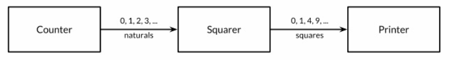
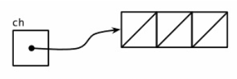
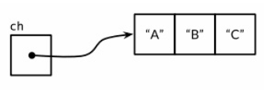
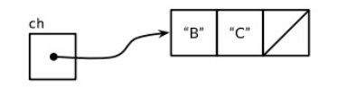

# Goroutines 和 Channels

并发程序指同时进行多个任务的程序，随着硬件的发展，并发程序变得越来越重要。Web 服务器会一次处理成千上万的请求。
平板电脑和手机 app 在渲染用户画面同时还会后台执行各种计算任务和网络请求。即使是传统的批处理问题——读取数据，
计算，写输出——现在也会用并发来隐藏掉 I/O 的操作延迟以充分利用现代计算机设备的多个核心。计算机的性能每年都在
以非线性的速度增长。

Go 语言中的并发程序可以用两种手段来实现。本章的 goroutine 和 channel，其支持“顺序通信进程”(communicating 
sequential processes)或被简称为 CSP。CSP 是一种现代的并发编程模型，在这种编程模型中值会在不同的运行实例
(goroutine)中传递，尽管大多数情况下仍然是被限制在单一实例中。下一章覆盖更为传统的并发模型：多线程共享内存。

尽管 Go 对并发的支持是从多强力特性之一，但跟踪调试并发程序还是很困难，在线性程序中形成的直觉往往还会使我们
误入歧途。

### Goroutines

在 Go 语言中，每一个并发的执行单元叫做一个 goroutine。当一个程序启动时，其主函数即在一个单独的 goroutine
中运行，我们叫它 main goroutine。新的 goroutine 会用 go 语句来创建。在语法上，go 语句是一个普通的函数
或方法调用前加上关键字 go。go 语句会使其语句中的函数在一个新创建的 goroutine 中运行。而 go 语句本身会迅
速地完成。

```go
f()     // call f(); wait for it to return
go f()  // create a new goroutine that calls f(); don't wait
```

使用低效的递归计算菲波那契数列：[spinner.go](./cmd/spinner.go)。

以上代码主函数返回时，所有的 goroutine 都会被直接打断，程序退出。除了从主函数退出或者直接终止程序之外，
没有其它的编程方法能够让一个 goroutine 来打断另一个的执行，但是之后可以看到一种方式来实现这个目的，
通过 goroutine 之间的通信来让一个 goroutine 请求其它的 goroutine，并让被请求的 goroutine 自行结束
执行。

### 并发的 Clock 服务

网络编程是并发大显身手的一个领域，由于服务器是最典型的需要同时处理很多连接的程序，这些连接一般来自于彼此独
立的客户端。

顺序执行的时钟服务器，每隔一秒钟将当前时间写到客户端：[clock1.go](./cmd/clock1.go)。与之配合使用的客户
端：[netcat1.go](./cmd/netcat1.go)。第二个客户端必须等待第一个客户端完成工作，这样服务端才能继续向后
执行，因为这个时钟服务器同一时间只能处理一个客户端连接。

现在对 clock1 进行小小的修改，在调用 handleConn 函数前加上 go 关键字，让每一次 handleConn 的调用都进
入一个独立的 goroutine：[clock2.go](./cmd/clock2.go)。现在多个客户端可以同时接收到时间了。

### 并发的 Echo 服务

大多数的 echo 服务仅仅会返回他们读取到的内容，如下：

```go
func handleConn(c net.Conn) {
	io.Copy(c, c) // NOTE: ignoring errors
	c.Close()
}
```

一个更有意思的 echo 服务应该模拟一个实际的 echo 的"回响"，并且一开始要用大写 HELLO 来表示"声音很大"，之后经过一小段延迟返回一个
有所缓和的 Hello，然后一个全小写字母的 hello 表示声音渐渐变小直至消失[reverb1.go](./cmd/reverb1.go)。这个程序有点小问题，就是
在前一个输出完成之前，后一个输出只能等着。

```
$ ./reverb1 &
$ ./netcat2
Hello
    HELLO
Test
    Hello
    hello
    TEST
    Test
    test
```

需要更多的 goroutine 来做这件事情[reverb2.go](./cmd/reverb2.go)。

### Channels

如果说 goroutine 是 Go 语言程序的并发体的话，那么 channels 则是它们之间的通信机制。一个 channel 是一个通信机制，它可以让一个 goroutine
通过它给另一个 goroutine 发送值信息。每个 channel 都有一个特殊的类型，也就是 channels 可发送数据的类型。一个可以发送 int 类型数据的
channel 一般写为 chan int。

使用内置的 make 函数，可以创建一个 channel：

```go
ch := make(chan int) // ch has type 'chan int'
```

和 map 类似，channel 也对应一个 make 创建的底层数据结构的引用。复制一个 channel 或用于函数参数传递时，只是拷贝了一个 channel 引用，
因此调用者和被调用者将引用同一个 channel 对象，和其它的引用类型一样，channel 的零值也是 nil。

两个相同类型的 channel 可以使用 == 运算符比较。如果两个 channel 引用的是相同的对象，那么比较的结果为真。一个 channel 也可以和 nil 
进行比较。

一个 channel 有发送和接受两个主要操作，都是通信行为。一个发送语句将一个值从一个 goroutine 通过 channel 发送到另一个执行接收操作的
goroutine。发送和接收两个操作都使用`<-`运算符。在发送语句中，`<-`运算符分割 channel 和要发送的值。在接收语句中，`<-`运算符写在
channel 对象之前。一个不使用接收结果的接收操作也是合法的。

```go
ch <- x     // a send statement
x = <- ch   // a receive expression in an assignment statement
<- ch
```

Channel 还支持 close 操作，用于关闭 channel，随后对基于该 channel 的任何发送操作都将导致 panic 异常。对一个已经被 close 过的 channel
进行接收操作依然可以接受到之前已经成功发送的数据；如果 channel 中已经没有数据的话将产生一个零值的数据。

```go
close(ch)
```

以最简单方式调用 make 函数创建的是一个无缓存的 channel，但是也可以指定第二个整型参数，对应 channel 的容量。如果 channel 的容量大于零，
那么该 channel 就是带缓存的 channel。

```go
ch = make(chan int)     // unbuffered channel
ch = make(chan int, 0)  // unbuffered channel
ch = make(chan int, 3)  // buffered channel with capacity 3
```

#### 不带缓存的 Channels

一个基于无缓存 Channels 的发送操作将导致发送者 goroutine 阻塞，直到另一个 goroutine 在相同的 Channels 上执行接收操作，当发送的值
通过 Channels 成功传输之后，两个 goroutine 可以继续执行后面的语句。反之，如果接收操作先发生，那么接收者 goroutine 也将阻塞，直到有
另一个 goroutine 在相同的 Channels 上执行发送操作。

基于无缓存 Channels 的发送和接收操作将导致两个 goroutine 做一次同步操作。因为这个原因，无缓存 Channels 有时候也被称为同步 Channels。
当通过一个无缓存 Channels 发送数据时，接收者收到数据发送在唤醒发送者 goroutine 之前（happens before，这是 Go 语言并发内存模型的一个
关键术语！）。

在讨论并发编程时，当我们说 x 事件在 y 事件之前发生(happens before)，这并不是说 x 事件在时间上比 y 时间更早；我们要表达的意思是要保证在
此之前的事件都已经完成了，可以放心依赖这些已完成的事件了。

当我们说 x 事件既不是在 y 事件之前发生也不是在 y 事件之后发生，我们就说 x 事件和 y 事件是并发的。这并不是意味着 x 事件和 y 事件就一定
是同时发生的，只是不能确定这两个事件发生的先后顺序。在下一间将看到，当两个 goroutine 并发访问了相同的变量时，我们有必要保证某些事件的执行
顺序，以避免出现某些并发问题。

以下程序使用了一个 channel 来同步两个 goroutine，以让主 goroutine 等待后台 goroutine 完成工作后再退出[netcat3.go](./cmd/netcat3.go)。
当用户关闭了标准输入，主 goroutine 中的 mustCopy 函数调用将返回，然后调用 conn.Close() 关闭读和写方向的网络连接。关闭网络连接中的写方向
的连接将导致 server 程序收到一个文件(end-of-file)结束的信号。

#### 串联的 Channels(Pipeline)

Channels 也可以用于将多个 goroutine 连接在一起，一个 Channel 的输出作为下一个 Channel 的输入。这种串联的 Channels 就是所谓的管道
(pipeline)。如下程序用两个 channels 将有三个 goroutine 串联起来。



[pipeline1.go](./cmd/pipeline1.go)

如果发送者知道，没有更多的值需要发送到 channel 的话，那么让接收者也能及时知道没有多余的值可接收将是有用的，因为接收者可以停止不必要的接收等待。
这可以通过内置的 close 函数来关闭 channel 实现：

```go
close(naturals)
```

当一个 channel 被关闭后，再向该 channel 发送数据将导致异常。当一个被关闭的 channel 中已经发送的数据都被成功接收后，后续的接收操作将不再
阻塞，它们会立即返回一个零值。关闭上例中的 naturals 变量对应的 channel 并不能终止循环，它依然会收到一个永无休止的零值cbyc，然后将它们发送
给打印者 goroutine。

`没有办法直接测试一个 channel 是否被关闭，但是接收操作有一个变体形式；它多接收一个结果，多接收的第二个结果是一个布尔值 ok，true 表示成功从
channel 接收到值，false 表示 channels 已经被关闭并且里面没有值可接收。`据此，可用如下代码：

```go
// squarer
go func() {
    for {
    	x, ok := <- naturals
    	if !ok {
    		break // channel was closed and drained
    	}
    	squares <- x * x
    }	
    close(squares)
}()
```

但这种语法是笨拙的，可以使用更简洁的 for range 循环接收 channel 数据，当 channel 被关闭并且没有值可接收时跳出循环
[pipeline2.go](./cmd/pipeline2.go)。

其实不需要关闭每一个 channel，只有需要告诉接收者 goroutine 所有数据已经全部发送时才关闭 channel。不管一个 channel 是否被关闭，当它没有
被引用时将会被 Go 语言的垃圾自动回收器回收。(`不要将关闭一个打开文件的操作和关闭一个 channel 操作混淆。对于每个打开的文件，都需要在不使用
的时候调用对应的 Close 方法来关闭文件。`)

试图重复关闭一个 channel 将导致 panic 异常。试图关闭一个 nil 值的 channel 也将导致 panic 异常。关闭一个 channel 还会触发一个广播机制。

#### 单方向的 Channel

随着程序的增长，人们习惯于将大的函数拆分为小的函数。将前例中的三个 goroutine 拆分为以下三个函数是自然的想法：

```go
func counter(out chan int)
func squarer(out, in chan int)
func printer(in chan int)
```

其中 squarer 的两个 channel 参数，一个用于输入一个用于输出，使用的方式相反，但是并无法禁止 squarer 函数向一个 in 参数对应的 channel
发送数据或者从一个 out 参数对应的 channel 接收数据。

这种场景是典型的。当一个 channel 作为一个函数参数时，它一般总是被专门用于只发送或者只接收。为了表明这种意图并防止被滥用，Go 语言的类型系统
提供了单方向的 channel 类型，分别用于只发送或只接收的 channel。类型`chan <- int`表示一个只发送 int 的 channel；相反，类型`<- chan int`
表示一个只接收 int 的 channel。这种限制将在编译期检测。

因为关闭操作只用于断言不再向 channel 发送新数据，所以只有在发送者所在的 goroutine 才会调用 close 函数，因此对一个只接收的 channel 调用
close 将是一个编译错误。

[pipeline3.go](./cmd/pipeline3.go)

调用 counter(naturals) 将 chan int 类型的 naturals 隐式地转换为`chan <- int`类型，其它同理。

#### 带缓存的 Channels

带缓存的 Channel 内部持有一个元素队列。队列的最大容量在调用 make 函数创建 channel 时通过第二个参数指定。下面语句创建了一个可以持有三个字符
串元素的带缓存的 Channel，下图是 ch 变量对应的 channel 的图形表示形式。

```go
ch = make(chan string, 3)
```



向缓存 Channel 的发送操作就是向内部缓存队列的尾部插入元素，接收操作则是从队列的头部删除元素。如果内部缓存队列是满的，那么发送操作将阻塞直到
因另一个 goroutine 执行接收操作而释放了新的队列空间。相反，如果 channel 是空的，接收操作将阻塞直到有另一个 goroutine 执行发送操作而向
队列插入元素。

可以在无阻塞的情况下连续向新创建的 channel 发送三个值：

```go
ch <- "A"
ch <- "B"
ch <- "C"
```

此刻，channel 的内部缓存队列将是满的，如果有第四个发送操作将发生阻塞。



如果接收一个值：

```go
fmt.Println(<- ch) // "A"
```

那么 channel 的缓存队列将不是满的也不是空的，因此对该 channel 执行的发送或接收操作都不会发生阻塞。通过这种方式，channel 的缓存队列解耦
了接收和发送的 goroutine。



某些特殊情况下，程序可能需要知道 channel 内部缓存的容量或有效元素的个数，可以用内置的 cap 或 len 函数获取：

```go
fmt.Println(cap(ch)) // "3"
fmt.Println(len(ch)) // "2"
```

该例中，发送和接收操作都在同一个 goroutine 中，但是在真实的程序中它们一般由不同的 goroutine 执行。

下例展示了一个使用了带缓存 channel 的应用。它并发地向三个镜像站点发出请求，并处理响应最快的那个。顺便说句，多个 goroutines 并发地向
同一个 channel 发送数据，或从同一个 channel 接收数据都是常见的用法。

```go
func mirroredQuery() string {
	responses := make(chan string, 3)
	go func() { responses <- request("asia.gopl.io") }()
	go func() { responses <- request("europe.gopl.io") }()
	go func() { responses <- request("americas.gopl.io") }()
	return <- responses // return the quickest response
}

func request(hostname string) (response string) { /* ... */ }
```

如果我们使用了无缓存的 channel，那么两个慢的 goroutines 将会因为没有人接收而被永远卡住。这种情况，称为 goroutines 泄漏，这将是一个 BUG。
和垃圾变量不同，泄漏的 goroutines 并不会被自动回收，因此确保每个不再需要的 goroutine 能正常退出是重要的。

关于无缓存或带缓存 channels 之间的选择，或者是带缓存 channels 容量大小的选择，都可能影响程序的正确性。无缓存 channel 更强地保证了每个发送
操作与相应的同步接收操作；但是对于带缓存 channel，这些操作是解耦的。

### 并发的 Web 爬虫

### 基于 select 的多路复用

[countdown1.go](./cmd/countdown1.go)

以下程序与上面的程序相比，需要等待两个 channel 中的其中一个返回事件。我们无法做到从每一个 channel 中接
收信息，如果这么做的话，如果第一个 channel 中没有事件发过来那么程序就会立刻被阻塞，这样就无法收到第二个
channel 中发过来的事件。这时候需要多路复用(multiplex)这些操作了，为了能够多路复用，我们使用了 select
语句。

[countdown2.go](./cmd/countdown2.go)

```go
select {
case <- ch1:
	// ...
case x := ch2:
    // ...use x...
case ch3 <- y:
    // ...
default:
    // ...
}
```

上面是 select 语句的一般形式。每一个 case 代表一个通信操作（在某个 channel 上进行发送或者接收）并且
会包含一些语句组成的一个语句块。一个接收表达式可能只包含接收表达式自身（不把接收到的值赋值给变量什么的），
就像上面的第一个 case，或者包含在一个简短的变量声明中，像第二个 case 里一样。

select 会等待 case 中有能够执行的 case 时去执行。当条件满足时，select 才会去通信并执行 case 之后
的语句；这时候其它通信是不会执行的。一个没有任何 case 的 select 语句写作 select{}，会永远地等待下去。

[betweenCountdown2and3.go](./cmd/betweenCountdown2and3.go)

下面一个例子更微妙[surprise.go](./cmd/surprise.go)

如果多个 case 同时就绪时，select 会随机地选择一个执行，这样来保证每一个 channel 都有平等的被 select
的机会。增加前一个例子的 buffer 大小会使期输出变得不确定，因为当 buffer 既不为满也不为空时，select 语
句的执行情况就像是抛硬币的行为一样是随机的。

[countdown3.go](./cmd/countdown3.go)