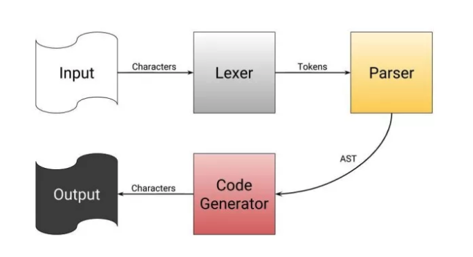
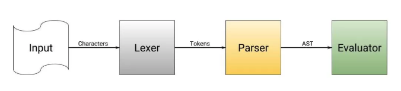

### 编译器原理

编程语言本质上只是一个软件，这个软件叫做编译器，编译器读入一个文本文件，经过大量的处理，最终产生一个二进制文件。编译器可以是任何可以把文本文件
转换成其他文件的程序。

简言之，编译器获取源代码，产生一个二进制文件。因为从复杂的、人类可读的代码直接转化成0/1二进制会很复杂，所以编译器在产生可运行程序之前有多个步骤：

1.  从给定的源代码中读取单个词。
2.  把这些词按照单词、数字、符号、运算符进行分类。
3.  通过模式匹配从分好类的单词中找出运算符，明确这些运算符想进行的运算，然后产生一个运算符的树（表达式树）。
4.  最后一步遍历表达式树中的所有运算符，产生相应的二进制数据。

尽管以上说的编译器直接从表达式树转换到二进制，但实际上它会产生汇编代码，之后汇编代码会被汇编/编译到二进制数据。汇编程序就好比是一种高级的、人类
可读的二进制。

**解释器又是什么？**

解释器非常像编译器，它也是读入编程语言的代码，然后处理这些代码。尽管如此，解释器会跳过了代码生成，然后即时编译并执行 AST。 解释器最大的优点就在
于在 debug 期间运行程序所消耗的时间。编译器编译一个程序可能在一秒到几分钟不等，然而解释器可以立即开始执行程序，而不必编译。解释器最大的缺点在
于它必须安装在用户电脑上，程序才可以执行。

#### 词法分析

[lexer.go](lexer.go)
