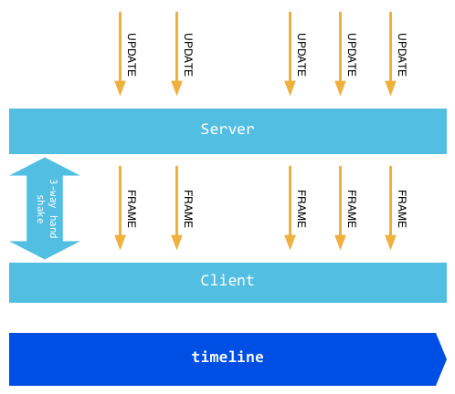

WebSocket 是 H5 的重要特性，它实现了基于浏览器的远程 socket，它使浏览器和服务器可以进行全双工通信，许多浏览器（Firefox、Chrome 和 Safari）
都已对此做了支持。

在 WebSocket 出现之前，为了实现即时通信，采用的技术都是"轮询"，即在特定的时间间隔内，由浏览器对服务器发出 HTTP Request，服务器在收到请求后，
返回最新的数据给浏览器刷新，"轮询"使得浏览器需要对服务器不断发出请求，这样会占用大量带宽。

WebSocket 采用了一些特殊报头，使得浏览器和服务器只需要做一个握手的动作，就可以在浏览器和服务器之间建立一条连接通道。且此连接会保持在活动状态，
可以使用 JS 来向连接写入或从中接收数据，就像在使用一个常规的 TCP Socket 一样。它解决了 Web 实时化的问题，相比传统 HTTP 有如下好处：

*   一个 Web 客户端只建立一个 TCP 连接；
*   WebSocket 服务端可以推送(push)数据到 web 客户端；
*   有更加轻量级的头，减少数据传送量；

WebSocket URL 的起始输入是`ws://`或`wss://`(在 SSL 上)。下图是 WebSocket 的通信过程，一个带有特定报头的 HTTP 握手被发送到服务器端，接着
在服务器端或者客户端就可以通过 JS 来使用某种套接口(socket)，这一套接口可被用来通过事件句柄异步接收数据。

### WebSocket 原理

WebSocket 协议颇为简单，在第一次 handshake 通过以后，连接便建立成功，其后的通讯数据都以"\x00"开头，以"\xFF"结尾。在客户端，这个是透明的，
WebSocket 组件会自动将原始数据"掐头去尾"。

浏览器发出 WebSocket 连接请求，然后服务器发出回应，然后连接建立成功，这个过程通常称为"握手"(handshaking)。

### Go 实现 WebSocket

Go 语言标准包里面没有提供对 WebSocket 的支持，但是在由官方维护的 go.net 子包中有对这个的支持，可以通过以下命令获取该包：`go get golang.org/x/net/websocket`。
