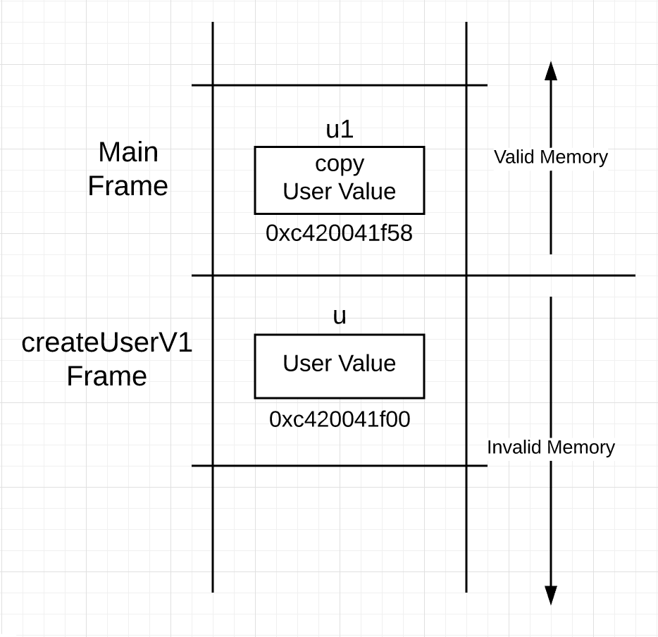
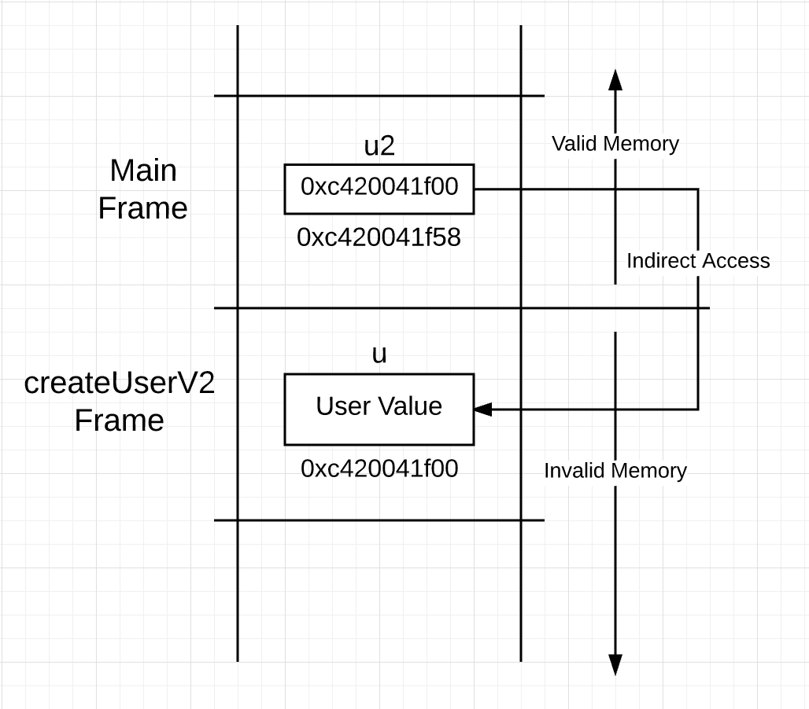
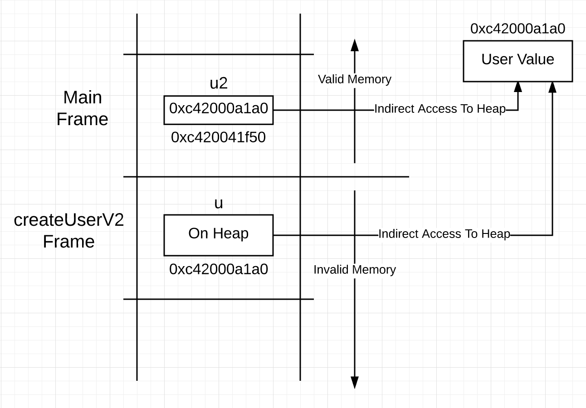

### Go 语言机制之逃逸分析(Language Mechanics On Escape Analysis)

#### 介绍(Introduction)

逃逸分析是编译器用来决定程序中值的位置的过程。特别地，编译器执行静态代码分析，以确定一个结构体的实例化值是否会逃逸到堆。在 Go 语言中，
没有可用的关键字或者函数，能够直接让编译器做这个决定。只能够通过写代码的方式来作出这个决定。

#### 堆(Heaps)

堆是内存的第二区域，除了栈之外，用来存储值的地方。堆无法像栈一样能自清理，所以使用这部分内存会千万很大开销（相比于使用栈）。重要的是，
开销跟 GC（垃圾收集），即被牵扯进来保证这部分区域干净的程序，有很大的关系。当垃圾收集程序运行时，它会占用可用 CPU 容量的 25%。更有甚者，
它会千万微秒级的"stop the world"的延时。拥有 GC 的好处是可以不再关注堆内存的管理，这部分很复杂，是容易出错的地方。

在 Go 中，会将一部分值分配到堆上。这些分配给 GC 带来了压力，因为堆上没有被指针索引的值都需要被删除。越多需要被检查和删除的值，会给每次
运行 GC 时带来越多的工作。所以，分配算法不断地工作，以平衡堆的大小和它运行的速度。

#### 共享栈(Sharing Stacks)

在 Go 语言中，不允许 goroutine 中的指针指向另外一个 goroutine 的栈。这是因为当栈增长或者收缩时，goroutine 中的栈内存会被一块新的内存替换。
如果运行时需要追踪指向其他的 goroutine 的栈，就会千万非常多需要管理的内存，以至于更新指向那些栈的指针将使"stop the world"问题更严重。

#### 逃逸机制(Escape Machanics)

任何时候，一个值被分享到函数栈帧范围之外，它都会在堆上被重新分配。这是逃逸分析算法发现这些情况和管控这一层的工作。（内存的）完整性在于确
保对任何值的访问始终是准确、一致和高效的。

[list.go](list.go)

在以上代码中，可以看到创建 user 值，并返回给调用者的两个不同函数。在函数版本 1 中，返回值。

```
16	func createUserV1() user {
17		u := user{
18			name:	"Bill",
19			email:	"bill@ardanlabs.com",
20		}
21
22		println("V1", &u)
23		return u
24	}
```

该函数返回的是值是因为这个被函数创建的 user 值被拷贝并传递到调用栈上。这意味着调用函数接收到的是这个值的拷贝。第 17 行到第 20 行是 user 值
被构造的过程。在第 23 行，user 值的副本被传递到调用栈并返回给调用者。函数返回后，栈看起来如下。



可以看到，当调用完 createUserV1，一个 user 值同时存在（两个函数的）栈帧中。在函数版本 2 中，返回指针。

```
27	func createUserV2() *user {
28		u := user{
29			name:	"Bill",
30			email:	"bill@ardanlabs.com",
31		}
32
33		println("V2", &u)
34		return &u
35	}
```

该函数返回的是指针是因为这个被函数创建的 user 值通过调用栈被共享了。这意味着调用函数接收到一个值的地址拷贝。

可以看到在第 28 行到第 31 行使用相同的字段来构造 user 值，从但是在第 34 行返回时却是不同的。不是将 user 值的副本传递到调用栈，而是将 user
值的地址传递到调用栈。基于此，也许你会认为栈在调用之后是这样子的。



但是如果看到上图真的发生的话，将遇到一个问题。指针指向了栈下的无效空间。当 main 函数调用下一个函数，指向的内存将重新映射并将被重新初始化。

这就是逃逸分析将开始保持完整性的地方。在这种情况下，编译器将检查到，在 createUserV2 的（函数）栈中构造 user 值是不安全的，因此，替代地，
会在堆中构造（相应的）值。这（个分析并处理的过程）将在第 28 行构造时立即发生。

#### 可读性(Readability)

如果一个函数只能直接访问它的（函数栈）空间，或者通过（函数栈空间内的）指针，通过跳转访问（函数栈空间外的）外部内存。这意味着访问逃逸到堆上的
值也需要通过指针跳转。

上面的函数 createUserV2：

```
27	func createUserV2() *user {
28		u := user{
29			name:	"Bill",
30			email:	"bill@ardanlabs.com",
31		}
32
33		println("V2", &u)
34		return &u
35	}
```

语法隐藏了代码中真正发生的事情。第 28 行声明的变量 u 代表一个 user 类型的值。Go 代码中的类型构造不会告诉你值在内存中的位置。所以走到第 34 行
返回类型时，才知道值需要逃逸（处理）。这意味着，虽然 u 代表类型 user 的一个值，但对该值的访问必须通过指针进行。

可以在函数调用之后，看到堆栈就像下图。



在 createUserV2 函数栈中，变量 u 代表的值存在于堆中，而不是栈。这意味着用 u 访问值时，使用指针访问而不是直接访问。你可能会想，为什么不让 u 成
为指针，毕竟访问它代表的值需要使用指针？

```
27	func createUserV2() *user {
28		u := &user{
29			name:	"Bill",
30			email:	"bill@ardanlabs.com",
31		}
32
33		println("V2", u)
34		return u
35	}
```

如果如同以上代码这样做，将使代码缺乏重要的可读性。现在只关注 return。

return 告诉了我们什么了呢？它说明了返回 u 值的副本给调用栈。然而，当使用 & 操作符，return 又告诉了我们什么了呢？

使用 & 操作符，return 告诉我们 u 被分享给调用者，因此，已经逃逸到堆中。记住，当读代码的时候，指针是为了共享，& 操作符对应单词"sharing"。这在
提高可读性的时候非常有用，这（也）是不想失去的部分。

#### 编译器报告(Compiler Reporting)

想查看编译器（关于逃逸分析）的决定，可以让编译器提供一份报告。只需要在调用`go build`的时候，打开`-gcflags`开着，并带上`-m`选项。

实际上总共可以使用 4 个`-m`，（但）超过 2 个级别的信息就已经太多了。

```
$ go build -gcflags "-m -m" list.go
# command-line-arguments
./list.go:16:6: can inline createUserV1 as: func() user { u := user literal; println("V1", &u); return u }
./list.go:27:6: can inline createUserV2 as: func() *user { u := user literal; println("V2", &u); return &u }
./list.go:8:6: can inline main as: func() { u1 := createUserV1(); u2 := createUserV2(); println("u1", &u1, "u2", &u2) }
./list.go:9:20: inlining call to createUserV1 func() user { u := user literal; println("V1", &u); return u }
./list.go:10:20: inlining call to createUserV2 func() *user { u := user literal; println("V2", &u); return &u }
./list.go:9:20: main &u does not escape
./list.go:10:20: main &u does not escape
./list.go:10:20: main &u does not escape
./list.go:12:16: main &u1 does not escape
./list.go:12:27: main &u2 does not escape
./list.go:22:16: createUserV1 &u does not escape
./list.go:34:9: &u escapes to heap
./list.go:34:9:         from ~r0 (return) at ./list.go:34:2
./list.go:31:2: moved to heap: u
./list.go:33:16: createUserV2 &u does not escape
```

可以看到编译器报告是否需要逃逸处理的决定。编译器都说了什么呢？

可以看看这几行。

```
./list.go:22:16: createUserV1 &u does not escape
./list.go:34:9: &u escapes to heap
./list.go:34:9:         from ~r0 (return) at ./list.go:34:2
./list.go:31:2: moved to heap: u
./list.go:33:16: createUserV2 &u does not escape
```

以上就是说函数 createUserV1 调用 println 不会造成 user 值逃逸到堆。这是必须检查的，因为它会跟函数 println 共享 u；
类型为 user，并在 31 行被赋值的 u 值，因为第 34 行的 return 逃逸。最后一行是说，在第 33 行调用 println 不会造成 user 逃逸。

#### 结论

值在构建时并不能决定它将存在于哪里。只有当一个值被共享，编译器才能决定如何处理这个值。当在调用时，共享了栈上的一个值时，它就会逃逸。

每种方式都有（对应的）好处和（额外的）开销。保持在栈上的值，减少了 GC 的压力。但是需要存储，跟踪和维护不同的副本。将值放在堆上的指针，会
增加 GC 的压力。然而，也有它的好处，只有一个值需要存储，跟踪和维护。（其实，）最关键的是如何保持正确地、一致地以及均衡（开销）地使用。
