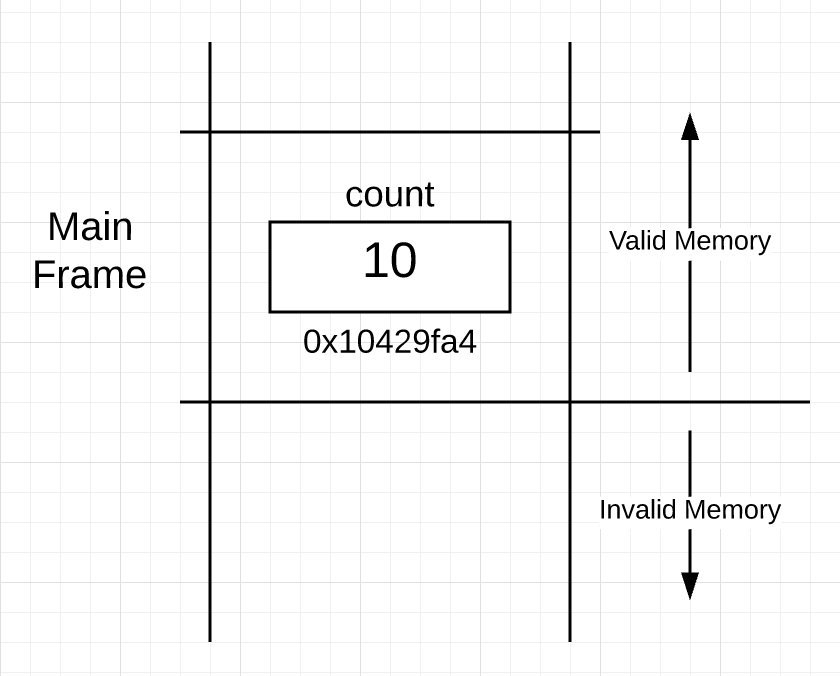
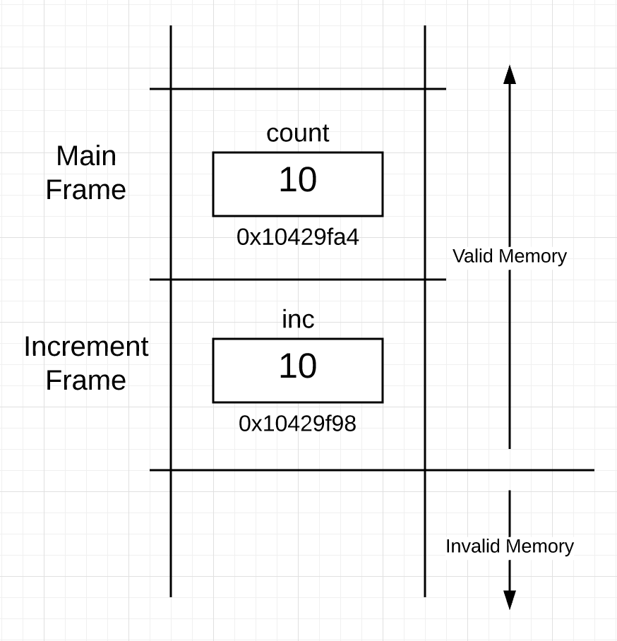
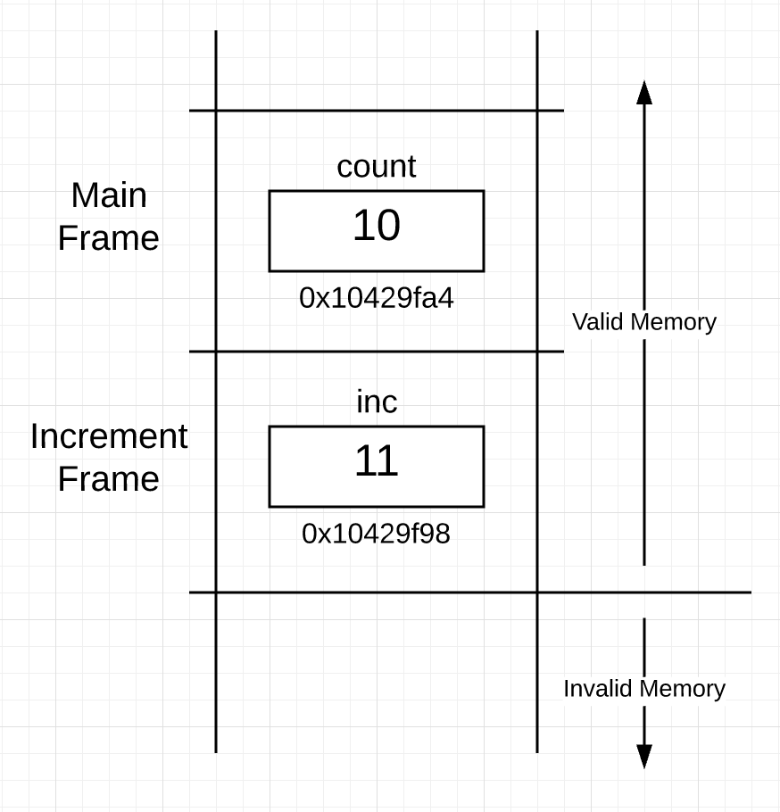
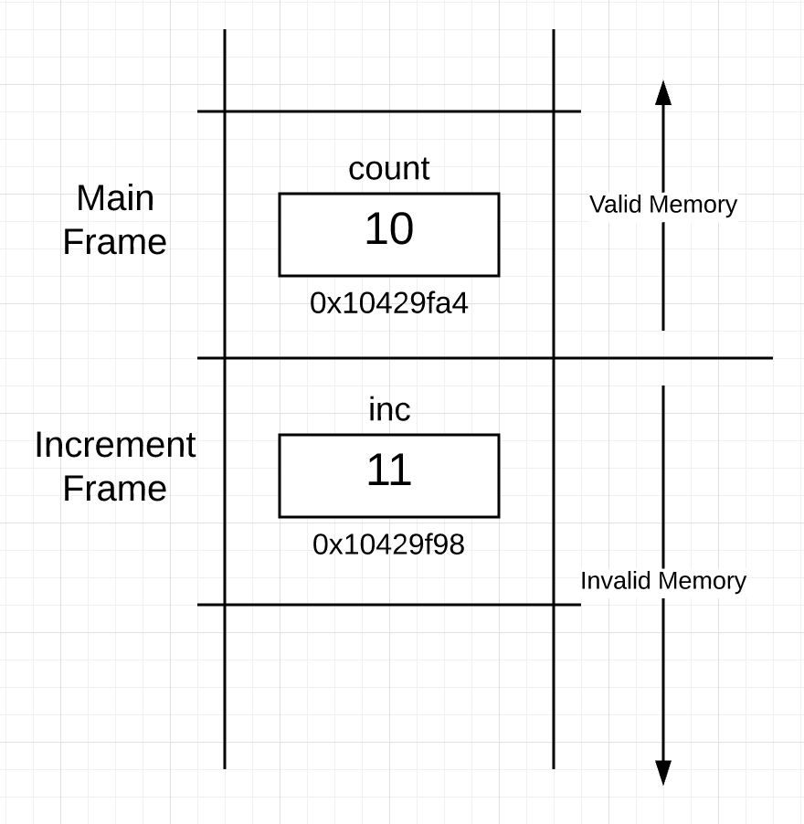
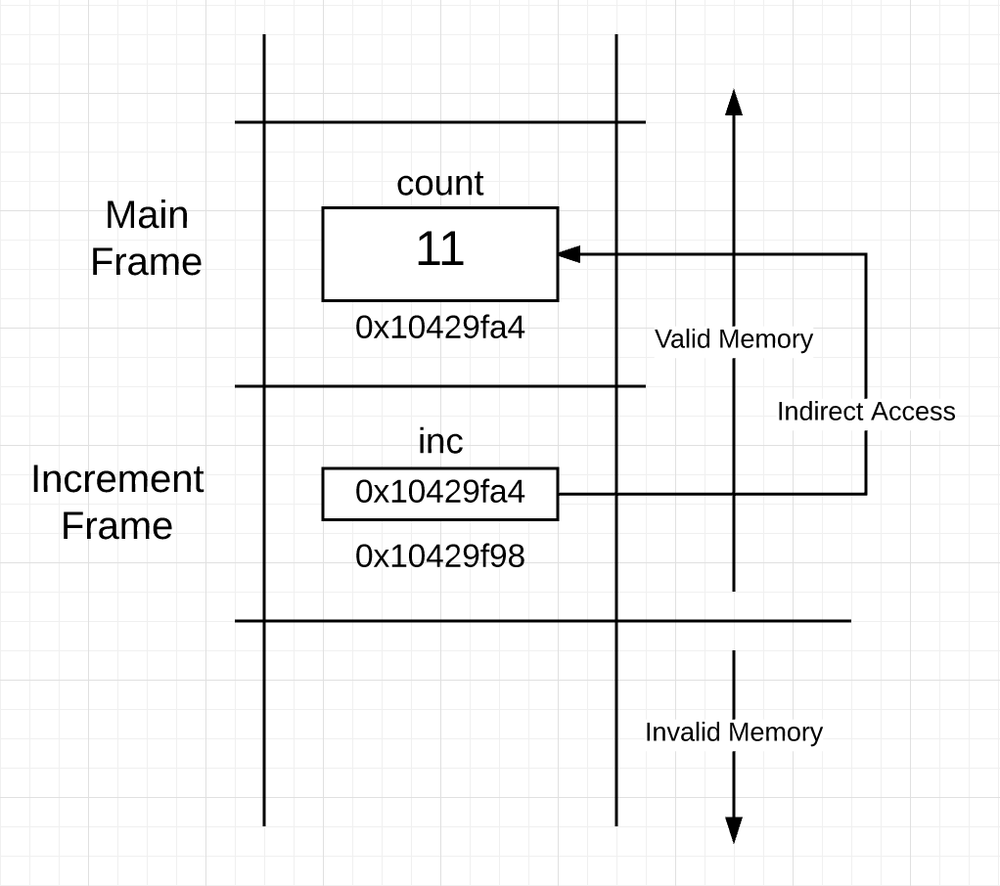

### Go 语言机制之栈和指针(Language Mechanics On Stacks And Pointers)

#### 帧边界(Frame Boundaries)

帧边界为每个函数提供了它自己独有的内存空间，函数就是在这个内存空间内执行的。帧边界除了可以让函数在自己的上下文环境中运行外还提供了一些流程
控制功能。函数可以通过帧边界指针直接访问自己帧边界中的内存，但如果想要访问自己帧边界外的内存，就需要用间接访问来实现了。要实现间接访问，被
访问的内存必须和函数共享，要想弄清楚共享是怎么实现的，就得先了解一下由这些帧边界建立起来的内存结构以及其中的一些限制。

当一个函数被调用时，会有两个相关的帧边界间进行上下文切换。从调用函数切换到被调用函数，如果函数调用时需要传递参数，那么这些参数值也要传递到被
调用函数的帧边界中。Go 语言中帧边界间的数据传递是按值传递的。

按值传递的好处是可读性好，拷贝并被函数接收到的值就是在函数调用时传入的值。这就是为什么把按值传递叫做 WYSIWYG(what you see is what you get)。
如果发生上下文环境转换时参数是按值传递的，就可以清楚地知道这个函数调用会怎样影响程序的执行。

看一下下面的程序，主程序用按值传递的方式调用了一个函数。

[list.go](list.go)

程序启动后，语言运行环境会创建 main goroutine 来执行包含在函数 main 内的所有初始化代码。goroutine 是被放置在操作系统纯种上的可执行序列，在 Go
语言的 1.8 版本中，为每一个 goroutine 分配了 2048 byte 的连续内存作为它的栈空间。这个初始化的内存大小几年来一起在变化，而且未来很有可能继续变化。

栈在 Go 语言中是非常重要的，因为它为分配给每个函数的帧边界提供了物理内存空间。main goroutine 在执行[list.go](list.go)中的代码时，goroutine
的栈看起来像下图这个样子（在一个比较高的语言层次）。



从上图中可以看到，一部分栈空间被框了起来，作为函数 main 的可用空间，这块栈区域叫做`栈帧`，正是它界定了函数 main 在栈上的边界。这块栈空间是在
函数被调用后，随着一些初始化代码的执行一并被创建的。可以看到变量 count 被放置到了函数 main 的栈帧中地址为 0x10429fa4 的地方。

在图 1 中也可以发现另外一点，就是在活动栈帧之下的栈空间是不可用的，只在活动栈帧以及它之上的栈空间是可用的。

#### 地址

变量名是为了标识一块内存，使代码更具可读性而存在的。如果已经有了一个变量，那在内存中就有一个值与它对应；反之，如果在内存中有一个值，就必须
有一个与之对应的变量，通过这个变量来访问这个内存值。在[list.go](list.go)的第 9 行，主函数调用了内置函数 println 来显示变量 count 的值
和地址。

```
8	println("count:\tValue Of[", count, "]\tAddr Of[", &count, "]")
```

在 32 位机器上运行这段代码，输出应该如下。

```
count:	Value Of[ 10 ] Addr Of[ 0x10429fa4 ]
```

#### 函数调用

在[list.go](list.go)第 11 行，函数 main 调用了函数 increment：

```
11	increment(count)
```

函数调用意味着 goroutine 需要在栈空间中创建一个新的栈帧。然而，这里并没有这么简单。要成功地调用一个函数，需要将数据在上下文转换过程中跨
栈帧边界传递到新建的栈帧中。特别的，对于 integer 值，在调用过程中需要拷贝并传递过去。在[list.go](list.go)第 17 行对函数 increment 的声明
语句中可以看到这一点：

```
17	func increment(inc int) {
```

如果再看一下第 11 行对函数 increment 的调用，可以看到传递的正是变量 count 的值。这个值经过拷贝、传递并最终放置到了函数 increment 的栈帧中。
因为函数 increment 只能直接访问自己栈帧里的内存，所以它用变量 inc 来接收、存储和访问从变量 count 传递过来的值。

在函数 increment 刚刚要开始执行的时候，goroutine 栈结构看起来像下面这样（从一个比较高的语言层次）。



可以看到，现在在栈里有两个栈帧，一个是函数 main 的，它下面的是函数 increment 的。在函数 increment 栈帧里，有一个变量 inc，它的值是当函
数调用时从外面拷贝并传递过来的 10，它的地址是 0x10429f98，因为栈帧是从上往下使用栈空间的，所以它的地址比上面的小，不过这只是一个实现细
节，并不保证所有实现都这样。重要的是 goroutine 把函数 main 的栈帧中的变量 count 的值拷贝并传递给了函数 increment 的栈帧中的变量 inc。

函数 increment 剩下的代码显示了变量 inc 的值和地址：

```
19	inc ++
20	println("inc:\tValue Of[", inc, "]\tAddr Of[", &inc, "]")
```

输出结果如下：

```
inc:	Value Of[ 11 ] Addr Of [ 0x10429f98 ]
```

当执行完这些代码以后，栈结构变成下面这样：



执行完第 19 行和第 20 行以后，函数 increment 返回，控制权重新回到了函数 main 中，然后函数 main 再一次显示了变量 count 的值和地址：

```
13	println("count:\tValue Of[", count, "]\tAddr Of[", &count, "]")
```

输出如下：

```
count:	Value Of[ 10 ] Addr Of [ 0x10429fa4 ]
```

#### 函数返回

当函数返回，控制权回到调用函数后，栈结构发生了什么变化呢？答案是什么也没有。下面就是当函数 increment 返回后，栈结构的样子：



除了函数 increment 函数的栈帧现在变为不可用外，其他和函数 increment 执行完时一模一样。这是因为函数 main 的栈帧变成了活动栈帧。对函数
increment 的栈帧没有做任何处理。

函数调用完成后，没有必须立即清理被调用函数的栈帧空间，这样做只会浪费时间，因为不知道那块内存之后是否会被再次用到。所以相应内存就原封不动
地留在那里。只有当发生了函数调用，这块内存被再次用到时，才会对它进行清理。清理过程是通过拷贝过来的值在这个栈帧中的初始化完成的，因为所
有的变量至少会被初始化为相应类型的零值，这就保证了发生函数调用时，栈空间一定会被合理地清理。

#### 值的共享

但是如果想在函数 increment 中直接操作存在于函数 main 的栈帧中的变量 count，应该怎么办？这时候就要用到指针了。指针存在的目的就是为了和
一个函数共享变量，从而让这个函数可以对这个共享变量进行读写，即使这个变量没有直接放置在这个函数的栈帧中。

如果在用指针时，一下子想到的不是`共享`，那就得看看是不是真的有必要使用指针了。用指针是为了共享。

#### 指针类型

对每个已经声明的类型，不管是语言自己定义的还是用户定义的，都有一个与之对应的指针类型，用它来进行数据共享。比如 Go 语言中有一个内置的 int
类型，所有一定有一个与 int 类型对应的叫做`*int`的指针类型。如果定义了一下 User 类型，那么语言会自动生成一个与之对应的`*User`指针类型。

所有指针类型都有两个共同点。

1.	以`*`开头；
2.	占用相同的内存大小（4 个字节或 8 个字节），并且表示的是一个地址；

规范一点说，指针类型被认为是一个字面类型(type literals)，也就是说它是通过对已有类型进行组合而成。

#### 间接内存访问

[list2.go](list2.go)

和[list.go](list.go)相比，新的程序存在 3 点不同

```
12	increment(&count)
```

在[list2.go](list2.go)第 12 行，并没有像之前一样传递变量 count 值，而是传递的变量 count 的地址。现在可以这么说，将要和函数 increment 共享
变量 count 了，这就是 & 操作符想要表达的。

变量仍然是按值传递的，唯一不同的是，这次传递的是一个 integer 的地址。地址同样是一个值；这就是在函数调用时跨越两个帧边界被拷贝和传递的东西。

鉴于有一个值正在被拷贝和传递，在函数 increment 中就需要一个变量来接收并存储这个基于地址的 integer 值，所以在程序的第 18 行把参数声明为
了`*int`类型。

```
18	func increment(inc *int) {
```

如果传递的是 User 类型的地址值，这里声明的类型就应该换成`*User`，尽管所有的指针存储的都是地址值，但是传递和接收的必须是同一个类型才可以，
这个是关键。之所以要共享一个变量，是因为在函数内要对那个变量进行读写操作，而只有知道了这个类型的具体信息后才可以这样做。编译器会保证传递
的是同一个指针类型的值。

以下是调用了函数 increment 后，栈结构的样子。


从上图可以看到，当把一个地址按值进行传递后，栈结构会变成什么样子。函数 increment 的栈帧中的指针变量 inc 指向了存在于函数 main 栈帧中的变
量 count。

通过这个指针变量，函数就可以以间接方式读写存在于函数 main 的栈帧中的变量 count 了。

```
21	*inc ++
```

这个时候，`*`被用作一个操作符和指针变量一起使用，把`*`用作操作符，意思是说要得到指针变量所指向的内容，在这里也就是函数 main 中的 count 变量。
指针变量允许在使用它的栈帧中间接访问此栈帧之外的内存空间。有时候把这种间接访问叫做指针的解引用。在函数 increment 中仍然需要一个可能直接访
问的本地指针变量来执行间接访问，在这里就是变量 inc。

当执行了第 21 行后，栈结构变成下面这样。



下面是程序的全部输出：

```
count:	Value Of[ 10 ]			Addr Of[ 0x10429fa4 ]
inc:	Value Of[ 0x10429fa4 ]	Addr Of[ 0x10429f98 ]	Value Points To[ 11 ]
count:	Value Of[ 11 ]			Addr Of[ 0x10429fa4 ]
```

可以看到，变量 inc 的值正是变量 count 的地址，就是这一个联系才使得访问本栈帧外的内存成为可能。一旦函数 increment 通过指针变量执行了写操作，
当控制返回到函数 main 后，修改就会反应到对应的共享变量中。

#### 指针型变量并不特别

指针类型和其他类型一样，一点也不特殊。它们有一块分配的内存并存放了一个值，抛开它指向的类型，指针类型总是占用同样的大小 并且有相同的表示。
唯一可能让人感到困惑的是字节`*`，在函数 increment 内部，它被用作操作符，在函数声明时用来声明指针变量。

#### 总结

以上讨论了设计指针背后的目的，以及在 Go 语言中栈和指针是怎样工作的。这是理解 Go 语言的语言机制、设计哲学的第一步，也是对写出一致、可读
性好的代码有一定的指导作用。

以上知识点可以总结如下：

1.	帧边界为每个函数提供了独立的内存空间，函数就是在自己的帧边界内执行的；
2.	当调用函数时，上下文环境会在两个帧边界间切换；
3.	按值传递的优点是可读性好；
4.	栈的非常重要的，因为它为分配给每个函数的帧边界提供了可访问的物理内存空间；
5.	在活动栈帧以下的栈空间是不可用的，只有活动栈帧和它之上的栈空间是可用的；
6.	函数调用意味着 goroutine 需要在栈上为函数创建一个新的栈帧；
7.	只有当发生了函数调用，栈区块被分配的栈帧占用后，相应栈空间才会被初始化；
8.	使用指针是为了和被调用函数共享变量，使被调用函数可以用间接方式访问自己栈帧之外的变量；
9.	每一个类型，不管是语言内置的还是用户定义的，都有一个与之对应的指针类型；
10.	使用指针变量的函数，可以通过它间接访问函数栈帧之外的内存；
11.	指针变量和其他变量一样，并不特殊，同样是有一块内存，在其中存放值而已；
