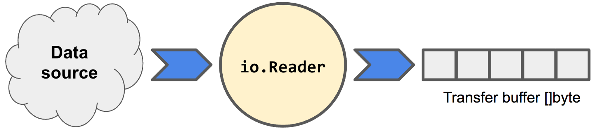

### Go 语言的 IO 流

在 Go 中，IO 操作是通过使用原语来把数据模拟为可读写的字节流来实现的。为了这个实现，Go 的 io 包提供了 io.Reader 和 io.Writer 接口分别进行
数据的输入和输出操作，如下图所示：


Go 附带了许多支持从内存结构、文件、网络连接等资源的 IO 流操作的 API。这篇文章着重于创建 Go 程序，这些程序能够使用 io.Reader 和 io.Writer 
接口的自定义实现和标准库的实现来传输数据。

#### io.Reader

reader 由 io.Reader 接口表示，它可以从一些数据源读取数据到一个可以流式传输以及消费的传输缓冲区中，如下图所示：



要使一个类型起到 reader 的作用，必须要使其实现 io.Reader 接口中的 Read(p []byte) 方法，如下所示：

```go
type Reader interface {
	Read(p []byte) (n int, err error)
}
```

Read() 方法的实现应该返回读取的字节数，如果出错了就返回它的错误。如果数据源已经耗尽，Read 方法应该返回 io.EOF。

#### 读取规则（附加）

在 Reddit 反馈后，我决定添加关于读取的这一小节，希望（对大家）有所帮助。reader 的行为取决于它的实现，但有一些规则来自 io.Reader 文档，
当你在直接从 reader 消费时应该知道这些规则：

1.  当可能时，Read() 会读取 len(p) 字节到 p 中；

2.  Read() 调用后，n 可能会小于 len(p)；

3.  出错时，Read() 可能仍然返回 n 个字节到缓冲区 p 中。例如，从 TCP socket 中读取时突然连接关闭了。这取决于你的需要，你可以选择保存这些
    字节到 p 中或者重试；
    
4.  当 Read() 耗尽可用的数据时，reader 可能返回非零的 n 和 err = io.EOF。然而，这取决于实现，流结束时，reader 可能选择返回非零的 n 和
    err = nil。在这种情况下，任何后续的读取都必须返回 n = 0，err = io.EOF；
    
5.  **最后，当一个 Read() 的调用返回 n = 0 和 err = nil 时并不意味着 EOF，因为下一次调用 Read() 可能返回更多数据；**

如你所见，可能直接从 reader 正确地读取流会比较棘手。幸运的是，标准库的 reader 遵循了了明知的方法，使其易于流式处理。不过，在使用 reader 
之前，最好还是查阅其文档。

#### 从 reader 流式传输数据

直接从 reader 流式传输数据是容易的。Read 方法被设计用于在循环体中调用，每次循环都从数据源中读取一块数据到 p 缓冲区中。循环会一直持续到
方法返回 io.EOF 错误。

下面是一个简单的例子，该例使用了一个用 strings.NewReader(string) 创建的字符串 reader，用来流式传输字符串源中的字节：[string_reader.go](./src/string_reader.go)。

以上源码用 make([]byte, 4) 创建了一个 4 字节的传输缓冲区 p。该缓冲区用来保存小于字符串源长度的数据。这是为了演示怎样正确地从大于缓冲区的
数据源流式传输数据块。

**更新**：有人在 Reddit 中指出上例有一个 bug。代码永远不会捕获非 nil 错误且不为 io.EOF 的实例。下面修复了代码[string_reader2.go](./src/string_reader2.go)。

#### 实现自定义 io.Reader

在上一节中使用了标准库实现的 IO reader。现在，让我们看看怎样自己实现。下面是一个 io.Reader 的简单实现，它会从流中过滤掉非字母字符[alpha_reader.go](./src/alpha_reader.go)。

当程序执行时，它会打印：

```bash
$ go run alpha_reader.go
HelloItSamwhereisthesum
```

#### 链式 Reader

标准库已经实现了很多 reader。用一个 reader 作为另一个 reader 的数据源是很普遍的。链式 reader 允许一个
reader 重用另一个的逻辑，如以下源码片段中，对 alphaReader 进行了修改，使得其可以接受一个 io.Reader 作
为它的数据源。通过把流传到根 reader 可以降低代码复杂性。


> 原文链接：[https://medium.com/learning-the-go-programming-language/streaming-io-in-go-d93507931185](https://medium.com/learning-the-go-programming-language/streaming-io-in-go-d93507931185)
